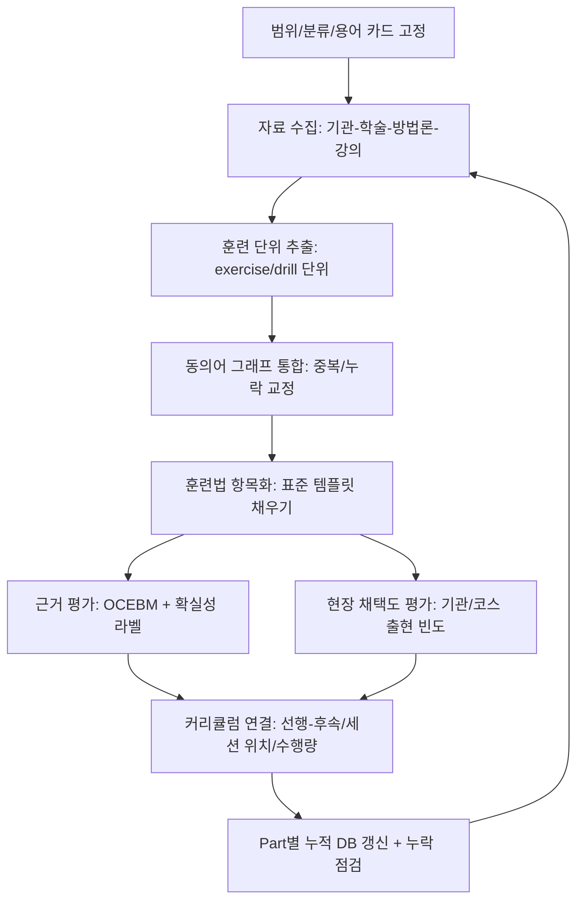

# 보컬 및 발성 프로그램 설계를 위한 심층 리서치  
Part 1

## Executive summary

이번 Part 1은 **(A) 전수 조사에 필요한 리서치 운영 체계(검색·수집·평가·누락 방지)**를 확정하고, **(B) 커리큘럼 설계에 직접 활용 가능한 ‘훈련법 데이터베이스 스키마’**를 고정하며, **(C) 용어 충돌(특히 호흡·지지·정렬·placement·register 관련)의 표준 처리 규칙(용어 카드/동의어 그래프)**을 적용 예시까지 제시한다. 이어서 **신체·정렬·긴장완화·호흡 인지·호흡 관리** 범주에서 **최소 10개 훈련법을 실제 항목 템플릿대로 상세 기술**하고, 각 항목마다 **근거 유형(OCEBM), 확실성(높음/중간/낮음/매우 낮음), 현장 채택도(높음/중간/낮음)**를 분리 표기해 **초급/중급/고급 커리큘럼 설계의 ‘부품 리스트’**로 바로 쓸 수 있게 만든다. (워밍업/쿨다운·SOVT·공명·레지스터·딕션 등은 Part 2 이후에서 같은 방식으로 확장한다.)

## Part 1 범위와 산출물

Part 1에서 “완료”로 간주할 산출물은 아래 5종이다.

첫째, **자료 수집·평가·누락 방지 운영 규칙(표준 운영 절차)**. 둘째, **전체 분류 체계 확정판(트리 + 다축 태그)**. 셋째, **용어 충돌 처리 프레임(용어 카드 + 동의어 그래프 + 번역 주석 규칙)**. 넷째, **훈련법 데이터베이스 스키마(필수 필드·형식·라벨 규칙)**. 다섯째, **초기 훈련법(신체·정렬·긴장완화·호흡) 10개 이상의 ‘완전 항목’**과 **Part 1 누적 데이터베이스 표(초기 버전)**.

아래 mermaid는 Part 1 이후 전체 프로젝트가 어떻게 “전수 조사 → 구조화 → 검증 → 누락 점검”으로 반복되는지(연속 보고서 운영) 흐름을 보여준다.

## 조사 전략과 자료 수집 및 평가 기준

### 검색·수집 전략

이 프로젝트는 “학파 요약”이 아니라 “훈련법 전수 조사”이므로, 검색은 **두 방향을 동시에** 굴린다.

- **Top-down(제도/기관·공식 방법론·학회/저널 축)**  
  1) 교육기관: 공식 **교과과정/강의계획서/과목 카탈로그**에서 “훈련 항목·순서·평가 방식”을 직접 추출  
  2) 학술: 인용 DB를 이용해 **리뷰 논문/메타분석/핵심 실험 연구** 중심으로 지도(mapping) 구축  
  3) 방법론: 창시자/대표 기관의 **공식 문헌·저서·공식 코스 자료**로 “훈련 레퍼토리(드릴 목록) + 지도 언어”를 확보  
  4) 학회: 보컬 페다고지/음성의학/음성치료의 교차 지점을 만드는 전문 조직 및 저널 축을 따라가며 누락을 줄임(예: 보이스 의학·연구 중심의 저널/학술조직, 보컬 페다고지 중심의 저널/조직). “Journal of Voice”가 음성의학·연구의 대표적 장이고 Voice Foundation과 연결된다는 설명은 저널 소개에서 확인된다. [CITE]

- **Bottom-up(훈련 단위 exercise/drill 명칭 기반)**  
  “복식호흡/diaphragmatic breathing”, “지지/support/breath management/appoggio”, “semi-supine/constructive rest/active rest”, “jaw release/free jaw/hanging jaw”처럼 **동일 훈련이 다른 이름으로 유통되는 네트워크**를 먼저 만들고, 그 그래프를 키워드 확장기로 사용한다(= 누락 방지 장치). 이 전략은 특히 “호흡·지지·register”에서 필수다(의미가 갈라지는 용어가 많기 때문).

문헌 DB는 **다학제 누락을 줄이기 위해** 인용·초록 DB(Scopus/WoS) + 의생명 DB(PubMed) + 학회/저널 포털(예: ASHA 저널·Voice Foundation 등)을 병행한다. Scopus와 WoS Core Collection이 “초록·인용 기반의 다학제 검색/추적”에 최적화된 DB로 소개되는 점은 각 DB 소개 문서에서 확인된다. [CITE]

### 출처 우선순위 적용 원칙

사용자가 지정한 우선순위(교육기관 공식 문서 → 논문/리뷰 → 방법론 공식 문헌 → 공식 강의/마스터클래스 → 신뢰 가능한 2차 자료)를 그대로 적용하되, **현실적으로 ‘훈련 절차(steps)·수행량(dosage)’는 논문보다 교육 문헌/핸드아웃에 더 잘 남는 경우가 많다**는 점을 운영 규칙에 반영한다. 즉,
- “효과/안전” 판단은 가능하면 **논문·리뷰**에 기대고,
- “현장에서 실제로 어떻게 가르치는가(단계·큐·수행량)”는 **강의계획서·교재·공식 핸드아웃·임상 프로토콜**을 적극 사용한다.
예: 반폐쇄성도(SOVT) 훈련의 과학적 합리화는 Titze의 SOVT 논문이 대표적이다. [CITE]  
반면 “호흡 재교육”의 구체 단계는 의료기관/SLP 핸드아웃이 절차를 더 명확히 제공하기도 한다(예: ‘Diaphragmatic Breathing’ 손 위치·흡기/호기 방법). [CITE]

### 증거(근거) 평가 규칙

Part 1부터 모든 훈련법 항목에 다음 3개 라벨을 **항상 분리**해 단다.

1) **근거 유형(OCEBM 레벨)**: 연구 설계 중심 라벨(예: 체계적 문헌고찰/메타분석, RCT, 코호트/전후 비교, 단일사례, 기전/전문가 의견 등). OCEBM 레벨 체계는 연구 설계 기반의 근거 분류표로 제시되어 있다. [CITE]  
2) **확실성(“GRADE 유사” 라벨)**: 높음/중간/낮음/매우 낮음. GRADE가 확실성(quality/certainty)과 권고 강도를 투명하게 분리하려는 접근이라는 점은 GRADE Working Group 및 Cochrane 자료에서 확인된다. [CITE]  
3) **현장 채택도**: 높음/중간/낮음. (교육기관 커리큘럼·대표 방법론·학회 자료·교재에서 “반복적으로 등장하는 정도”를 근거로 산정. 단, Part 1에서는 초기 추정치로 표기하고, Part 8~9에서 기관/온라인 코스 매트릭스를 만든 뒤 교정한다.)

### 안전·의학적 의뢰 기준(모든 훈련법 공통 안전 가드레일)

Part 1부터 “의학적 평가 필요 신호”는 모든 훈련 항목에 공통으로 연결한다. 대표적으로, 쉰 목소리가 일정 기간 지속되거나(예: 수 주 이상) 출혈·호흡곤란·삼킴 곤란 등 경고 신호가 있으면 진료/평가가 필요하다는 안내가 공공 의료기관 자료에 존재한다. [CITE]  
또한 음성장애 평가·치료는 의사(특히 이비인후과) 진료가 중요하다는 임상 지침형 안내가 ASHA Practice Portal에 명시되어 있다. [CITE]

## 전체 분류 체계 확정과 데이터베이스 스키마 고정

### 분류 체계 확정판(트리 + 다축 태그)

Part 0 초안을 Part 1에서 다음 원칙으로 확정한다.

- **트리(내용 기반) 1개** + **태그(사용 맥락 기반) 여러 개** 병행  
- 트리는 “무엇을 훈련하나(기능/해부학)”를 우선하고, 태그는 “언제/누구/어떤 장르/어떤 위험”을 관리한다.

확정 트리(Part 1 기준)는 아래 8개 상위 범주로 고정한다.

1) 신체·정렬·긴장완화 (Body alignment / Release)  
2) 호흡 인지·호흡 관리 (Breath awareness / Breath management)  
3) 발성 개시·발성 조절 (Onset / Phonation / Adduction)  
4) SOVT/flow 저항 기반 (Semi-occluded / Flow-resistance)  
5) 공명·성도 형상·모음 조정 (Resonance / Vowel shaping / Formant)  
6) 레지스터·패사지오·벨팅/믹스 (Register / Passaggio / Belt-Mix)  
7) 딕션·조음·언어 (Diction / Articulation)  
8) 워밍업·쿨다운·부하관리·음성위생·자기모니터링 (Warm-up/Cool-down/Load/Hygiene/Self-monitoring)

이 트리는 음성치료에서 자주 쓰는 “respiration–phonation–resonance” 3-서브시스템 관점과도 호환되도록 설계한다(예: VFE가 호흡/발성/공명 균형을 명시). [CITE]  
또한 일부 대표 보컬 교육 체계가 Power–Source–Filter로 호흡(에너지), 성대(음원), 성도(필터)를 분리해 설명하는 점을 고려해(예: Estill의 PSF 설명), 태그로 “Power/Source/Filter”를 부여해 교차 비교가 가능하게 한다. [CITE]

### 데이터베이스 스키마(필수 필드) 고정

아래 필드는 Part 1부터 **모든 훈련법 항목에 반드시 채운다.**(빈 칸이면 “자료 부족”으로 명시)

- 식별: 훈련명(ko/en), 상위 범주, 동의어/다른 이름/유사 개념  
- 정의/맥락: 정의, 사용되는 교육 맥락(교육/치료/배우 발성 등), 대표 장르  
- 대상 적합성: 연령, 수준, 변성기 여부, 장르 목표, 문제 유형, 성부/음역  
- 기능/절차: 목표 기능, 수행 절차, 세부 단계, 지도 언어(감각/은유), 해부학·기능 해석  
- 오류/교정: 초보자 오류, 교정 방법  
- 효과/위험: 기대 효과, “효과 가능성과 목표 직접성(핵심 드릴 vs 보조)” 구분, 위험·금기, 독학 가능성, 대면 지도 필요성  
- 수행량: 1회 시간, 반복/세트, 주당 빈도, 세션 내 위치, 과훈련 위험  
- 연결: 선행 조건, 후속 연결 훈련  
- 평가: 주관 지표, 교사 관찰 지표, 객관 지표(가능 시 음향/공기역학), 녹음 비교 항목  
- 근거/채택: 근거 유형(OCEBM), 확실성, 현장 채택도, 상충 견해, 대표 출처(출처 유형/1차 여부/상업성/최신성 포함)

Part 1에서는 DB를 “표”로 제공하되, 각 행이 이 스키마의 축약본이 되도록 하고(핵심 필드 중심), 상세 내용은 아래 “훈련법 항목(완전 서술)”에 둔다.

## 용어 충돌 프레임과 용어 카드 초안

### 용어 충돌을 “데이터”로 다루는 규칙

용어 충돌은 논쟁을 해결하려는 목적이 아니라, **커리큘럼 설계 시 오해·중복·누락을 방지**하기 위한 것이다. 그래서 Part 1부터 용어는 다음 4칸으로 기록한다.

- (1) 표제어(ko/en)  
- (2) 출처별 정의(학파/장르/치료/기관 문서) 병렬  
- (3) 동의어/이명(그래프)  
- (4) 조작화(관찰/평가 기준: “무엇이 관찰되면 이 용어를 쓴다”)

### 지정 핵심 용어: Part 1 ‘충돌 지도(초안)’

아래는 Part 1에서 “충돌 가능성”을 우선 표시한 목록이다(후속 Part에서 각 항목을 확장).

- **복식호흡**(흔히 diaphragmatic breathing으로 번역되나, 한국 교육 현장에서는 ‘배를 내민다/배에 힘’으로 오해되기 쉬움) → 의료기관 호흡 재교육은 ‘가슴/배 손 위치’로 흉부 과긴장을 줄이는 방식으로 제시되기도 한다. [CITE]  
- **appoggio**(이탈리아 전통 용어) ↔ **support/지지** ↔ **breath management**: 일부 문헌은 appoggio가 단순 공기 관리가 아니라 “구조적 지지 + 흡기/호기 근육 길항 균형”을 포함한다고 설명한다. [CITE]  
- **placement / mask resonance / resonance**: “공명이 얼굴 앞쪽에 모인다” 같은 지도 언어가 감각 큐로 쓰이지만, 물리적으로는 성도 형상, 포먼트, 음원-필터 상호작용으로 번역되어야 한다(Part 4에서 상세).  
- **chest voice / head voice / mix voice / middle voice / register / passaggio**: 장르(성악 vs 뮤지컬/CCM)와 학파에 따라 정의가 갈라지고, 동일 용어가 서로 다른 성대 조절(두께/접촉/후두 위치/성도)을 가리키는 경우가 많다(Part 5에서 핵심 쟁점으로 다룸).  
- **belt/belting / twang / speech-like singing / open throat / laryngeal position / healthy technique**: “건강한 테크닉”이 임상적 정상(무병)인지, 장르 성취(벨팅 가능)인지, 피로 누적 방지인지가 문맥마다 달라서, Part 5~7에서 “정의 슬롯”을 분리해야 한다.

### 용어 카드 적용 예시(Part 1 샘플)

**용어 카드 샘플 1 — 복식호흡(=diaphragmatic breathing?)**  
- 표제어: 복식호흡 / diaphragmatic breathing / abdominal breathing  
- 출처별 정의(초안):  
  - 의료/SLP 핸드아웃: 가슴·배에 손을 놓고, 코로 들이쉬며 “배가 바깥으로”, 입술 오므려 천천히 내쉼(자세 체크 포함). [CITE]  
  - 성악/보컬: “옆구리/등까지 360도 확장” 같은 큐를 쓰며, 흉곽-복부의 과긴장(어깨 상승)을 피하는 데 초점(Part 2에서 교차 수집 예정).  
- 동의어/이명: “배로 쉰다”, “아랫배 호흡”, “단전호흡(주의: 개념 혼입 위험)”  
- 번역 주석: “diaphragm(횡격막)”은 ‘배 근육’이 아니며, “배를 힘주어 내밀기”는 과긴장/과호기 패턴을 만들 수 있어, 지도 언어를 **관찰 가능한 신체 움직임(하부 흉곽 확장, 어깨 비상승)**으로 바꾸는 규칙을 둔다.  
- 조작화(평가 기준 예시): 어깨 상승/목 긴장 여부(교사 관찰), 흡기 시 하부 늑골 확장(촉진/거울), 발성 시 과도한 공기 누출/호기 붕괴 여부(녹음 + MPT 등).

**용어 카드 샘플 2 — appoggio / support / breath management**  
- 표제어: appoggio / support / breath management / 지지  
- 출처별 정의(초안):  
  - 일부 성악 문헌: appoggio를 단순 공기량 관리가 아니라 “흡기·호기 근육의 길항 균형 및 구조적 지지”로 설명. [CITE]  
- 동의어/이명: “버틴다/지탱한다(오해 위험)”, “호흡 지지”, “호흡 컨트롤”  
- 번역 주석: ‘support’는 한국어로 “힘을 준다”로 오해되기 쉬우므로, Part 2부터 “지지 신체 감각(확장 유지, 상체 과긴장 없음)”과 “측정 가능한 결과(호기 안정, 프레이즈 지속, 과압/과기류 없음)”를 분리 표기한다.  
- 조작화: 프레이즈 말미의 압력 붕괴/목조임 여부, 일정 다이내믹 유지, 과호기(air dump) 여부.

## Part 1 본격 조사: 초기 훈련법(신체·정렬·긴장완화·호흡) 항목집

아래부터는 **훈련법을 “데이터베이스 항목(완전 서술)”**으로 작성한다. 각 항목은 사용자가 지정한 형식을 최대한 그대로 사용하며, 근거와 현장 채택을 분리 표기한다.  
표기 규칙:  
- 근거 라벨: **[OCEBM]**, **[확실성]**, **[현장 채택도]**  
- 추가 경고: **[주의: 오용 위험]**, **[근거 약함/전승 중심]**, **[상업/홍보 가능]**

---

### 훈련법 1: Constructive Rest(세미-서파인 휴식)

- 훈련명: Constructive Rest(구성적 휴식) / semi-supine(세미-서파인) / active rest(액티브 레스트)  
- 상위 범주: 신체·정렬·긴장완화  
- 동의어/다른 이름/유사 개념: Alexander lie-down(알렉산더 “lying down”), semi-supine, active rest(표기 다양) [CITE]  
- 정의: 바닥(단단한 면)에서 **무릎을 세우고 머리 아래를 낮게 받친 자세**로 누워, 중력 부담을 줄인 상태에서 불필요한 긴장을 인지·완화하며 정렬 감각을 회복하는 자기 관리 절차. [CITE]  
- 사용되는 교육 맥락: 신체 사용(psycho-physical use) 훈련, 공연자 자기 관리(자세/긴장), 일부 배우 발성·보컬 레슨의 ‘리셋’ 절차(주로 교육 전통 기반). [CITE]  
- 대표 적용 장르: 성악/뮤지컬/CCM/배우 발성 전반(장르 비특이)  
- 적합 학습자 집단:  
  - 연령: 청소년~성인(허리 통증/기저 질환 있는 경우 수정 필요)  
  - 수준: 초급~프로(특히 과긴장/과사용 경향)  
  - 변성기: 가능(발성 자체를 과제로 삼지 않으므로)  
- 목표 기능: (1) 정렬 감각 회복, (2) 목·어깨·흉곽의 불필요한 긴장 감소, (3) 호흡의 자연스러운 움직임 인지(직접적 호흡 강화가 아니라 “과긴장 제거”).  
- 수행 절차:  
  1) 단단한 바닥에 매트/담요를 깐다.  
  2) 천장을 보고 눕고, **무릎을 세워 발바닥을 바닥에 둔다**(골반이 편한 폭).  
  3) 머리 아래는 과신전/과굴곡이 생기지 않도록 낮게 받친다(책/수건 등). [CITE]  
  4) “힘을 빼려 애쓰기”보다, 접촉면(후두부/견갑/골반/발)과 호흡 움직임을 관찰한다.  
- 세부 단계:  
  - 30~60초: 자세 세팅(허리 과긴장 있으면 보조)  
  - 5~10분: 신체 스캔(턱·혀·어깨·흉곽·복부)  
  - 1~2분: 일어나기(급히 일어나면 어지럼 가능)  
- 지도 시 자주 쓰는 감각 표현: “바닥이 몸을 받쳐준다”, “목이 길어지고 등이 넓어진다(과도한 스트레칭 아님)”, “갈비뼈가 저절로 움직인다”.  
- 해부학적/기능적 해석: 중력 하에서 서 있을 때 필요한 자세 유지 근긴장이 줄어들어, 과사용 패턴(특히 상부 승모근·목 주변)의 ‘기본 톤’을 낮추는 데 도움을 줄 수 있다는 가설적 해석. 단, 이는 기전 중심 설명이며 직접 실험 근거는 제한적이다. (Alexander Technique 전반의 연구는 있으나, constructive rest 단일 절차의 독립 근거는 별도 검토 필요.) [CITE]  
- 초보자의 흔한 오류:  
  - 허리를 바닥에 “붙이려고” 과도하게 복부 힘을 줌  
  - 머리를 높게 받쳐 턱이 가슴 쪽으로 당김  
  - “완전 이완”을 목표로 과도하게 힘을 빼며 졸림/무기력  
- 교정 방법:  
  - 허리 통증이면 무릎 아래를 약간 지지하거나 발 위치 조정  
  - 목에 불편감이면 머리 받침 높이 낮추기  
  - “힘을 빼라” 대신 “불필요한 긴장을 알아차리기”로 과제 변경  
- 기대 효과: 긴장 인지/완화, 자세 리셋, 과사용 후 회복 보조(직접적 발성 기술 습득용 드릴은 아님). [CITE]  
- 효과 가능성과 목표 직접성 구분: **간접 보조 훈련(회복/릴리즈)**  
- 위험 요소/주의점: 허리/목 통증 악화 시 중단, 어지럼/저혈압 경향 주의.  
- 금기 또는 제한: 급성 요통/디스크 악화, 특정 체위 제한이 있는 경우(의료 자문).  
- 독학 적합성: 중간~높음(자세 세팅만 정확하면 가능)  
- 대면 지도 필요성: 낮음~중간(통증이 있거나 과긴장 패턴이 심하면 지도 유익)  
- 권장 수행량: 10분 1~2회/일(전통적 권장으로 자주 제시되나, 표준화된 임상 용량 근거는 제한적) [CITE]  
- 워밍업/교정/기술 습득/회복 중 어디에 적합한지: **회복/긴장완화/자세 리셋**  
- 선행 조건: 없음(단, 통증 없는 체위 확보)  
- 후속 연결 훈련: 정렬 체크(서서), 호흡 인지 훈련(아래 훈련법 8), 턱·혀 릴리즈(훈련법 5~6)  
- 평가 지표:  
  - 주관: “목/어깨 노력감 감소”, “호흡이 쉬워짐”  
  - 교사 관찰: 서서 노래할 때 어깨 상승/목 긴장 완화 여부(전후 비교)  
  - 객관: 간접적—통증 점수, 자세 사진 비교(필요 시)  
- 연구 근거 유형: Alexander Technique 전반의 음악인 대상 체계적 문헌고찰은 존재하나, constructive rest 단독 근거는 제한적(전통/기관 자료 비중 큼). [CITE]  
- 연구 근거 수준: [OCEBM] 1(유관 분야 체계적 고찰) + 5(개별 절차는 전승 중심) / [확실성] 낮음  
- 현장 채택 정도: 높음(배우/공연자 자기 관리로 널리 알려짐) / 단, “보컬 테크닉” 커리큘럼의 핵심 드릴로 쓰이는 정도는 기관별 차이 예상  
- 상충되는 견해 여부: 있음 — “릴리즈는 유익하지만 직접 테크닉 향상과 연결이 약하다”는 관점 vs “기본 긴장 해소가 모든 테크닉의 토대” 관점  
- 대표 출처:  
  - 출처 유형: 교육/기관 자료(비학술) — constructive rest 절차 설명 [CITE]  
  - 출처 유형: 체계적 문헌고찰(음악인에서 Alexander Technique 효과) [CITE]  
- 라벨: **[근거 약함/전승 중심]**

---

### 훈련법 2: Postural Awareness & Alignment Check(정렬 인지·정렬 체크 루틴)

- 훈련명: 정렬 체크(Alignment check), 자세 인지(Postural awareness), neutral alignment(중립 정렬)  
- 상위 범주: 신체·정렬·긴장완화  
- 동의어/다른 이름/유사 개념: postural activities, body alignment, balance work  
- 정의: 노래 전(또는 중간) “몸의 스택(stack)”을 빠르게 점검하고, 긴장/통증 신호가 있는 부위를 조정해 **호흡과 발성을 방해하는 자세 패턴을 최소화**하는 루틴(단일 동작이 아니라 ‘체크리스트형 절차’).  
- 사용되는 교육 맥락: 성악/뮤지컬/CCM 레슨, 합창 발성, 배우 발성(전반)  
- 대표 적용 장르: 전 장르  
- 적합 학습자 집단:  
  - 연령: 청소년~성인(성장기에는 “모양 고정”보다 “유연한 중립” 강조)  
  - 수준: 초급(습관 형성)~고급(성능/부상 예방)  
  - 변성기: 가능(긴장 관리 목적)  
- 목표 기능: (1) 호흡 효율 확보(흉곽/복부 움직임의 자유), (2) 불필요한 근긴장 감소, (3) 통증·피로 누적 방지  
- 수행 절차(표준 루틴 예시):  
  1) 발바닥-무릎-골반-흉곽-머리의 정렬을 “위에서 누르기”가 아니라 “아래에서 쌓기”로 점검  
  2) 어깨 상승/흉곽 고정/전방머리자세(Forward head) 같은 패턴을 알아차리고 완화  
  3) 호흡 2~3회로 하부 흉곽 확장(옆구리/등 포함)을 확인  
- 세부 단계:  
  - 30초: 통증/뻣뻣함 스캔(목·턱·견갑·허리)  
  - 30초: 발-골반 기반(무릎 잠금/골반 과전·과후방) 확인  
  - 30초: 흉곽-머리 균형(턱 과내밀기/담기) 확인  
- 지도 언어: “키 크게” 대신 “목 자유 + 머리 균형”, “흉곽을 들어 올려 고정” 대신 “숨이 드나드는 공간을 남기기”  
- 해부학적/기능적 해석: 자세가 호흡(폐활량/흉복부 움직임)과 성도 형태(공명 공간)에 영향을 줄 수 있다는 연구 축이 있으며, 신체 자세·체위가 성도 용적/음향 변수에 유의미한 차이를 만들 수 있다는 결과가 보고된다. [CITE]  
- 초보자 오류:  
  - “좋은 자세=군대 자세”로 과긴장(흉곽 과신전, 목 고정)  
  - 무릎을 잠가(locked knees) 호흡·균형을 망침  
- 교정 방법:  
  - 정렬을 “고정 자세”가 아니라 “중립에서 움직일 수 있는 상태”로 재정의  
  - 영상/거울로 어깨·머리 위치를 확인(과도한 교정 금지)  
- 기대 효과: 통증/긴장 감소, 호흡 협응 개선, 발성 노력감 감소(개인차 큼)  
- 효과 가능성과 목표 직접성 구분: **일반적 토대 훈련(간접적이지만 영향 범위 넓음)**  
- 위험 요소/주의점: 과도한 자세 교정은 오히려 긴장 증가 가능  
- 금기 또는 제한: 급성 근골격 통증/신경 증상 시 전문 평가  
- 독학 적합성: 중간(영상 피드백이 있으면↑)  
- 대면 지도 필요성: 중간(특히 만성 통증/불균형이 있으면)  
- 권장 수행량: 매 세션 2~3분(워밍업 전), 무대/녹음 전 30~60초 리셋  
- 세션 위치: 워밍업 직전/중간 리셋/쿨다운 시 가벼운 스캔  
- 선행 조건: 없음  
- 후속 연결 훈련: 호흡 재교육(훈련법 8~9), 턱·혀 릴리즈(5~6)  
- 평가 지표:  
  - 주관: 노력감(RPE), 통증/긴장 자각  
  - 교사 관찰: 어깨 상승, 전방머리, 흉곽 고정 여부  
  - 객관: 설문/통증 기록, (가능 시) 호흡 측정(폐활량/호흡 패턴)  
- 연구 근거 유형:  
  - 오페라 가수 대상 연구에서 자세 관련 활동/해부학 지식이 음성 효율·감각과 관련될 수 있다는 보고(관찰 연구) [CITE]  
  - 체위가 성도 음향과 관련된다는 연구(실험) [CITE]  
- 연구 근거 수준: [OCEBM] 3~4 / [확실성] 낮음~중간(연구 이질성/간접성)  
- 현장 채택 정도: 높음(거의 모든 보컬 교육에서 “자세”는 기본 항목)  
- 상충되는 견해 여부: 있음 — “자세 교정에 과집착하면 소리/표현이 경직”이라는 비판 vs “정렬은 손상 예방과 효율의 토대” 관점  
- 대표 출처: 자세 활동과 음성/건강의 연관(오페라 가수 연구) [CITE], 체위-성도 음향 연구 [CITE]

---

### 훈련법 3: Body Mapping 기반 정렬 재교육(Body Map Correction)

- 훈련명: 바디 매핑(Body Mapping), body map correction(신체 지도 교정)  
- 상위 범주: 신체·정렬·긴장완화  
- 동의어/다른 이름/유사 개념: somatic education(소매틱 교육), anatomical imagery(해부학 이미지 기반 지도)  
- 정의: “뇌 속 신체 지도(body map)가 실제 해부학과 어긋날 때 비효율/통증이 생긴다”는 전제 아래, **해부학 지식 + 움직임 실험**으로 정렬·균형·호흡 움직임을 재학습하는 접근.  
- 사용되는 교육 맥락: 성악/뮤지컬/연기 전공의 신체 사용 교육, 일부 음악교육/퍼포머 트레이닝  
- 대표 적용 장르: 전 장르(특히 무대 움직임이 큰 뮤지컬/CCM에서 실용성 큼)  
- 적합 학습자 집단:  
  - 연령: 청소년~성인(아동은 개념 설명의 수준 조정 필요)  
  - 수준: 초급(기초 습관)~고급(통증/피로 관리)  
  - 주요 문제: 만성 어깨 상승, 흉곽 고정, 복부 과긴장, 무대 동작 시 자세 붕괴  
- 목표 기능: (1) 정렬/균형 향상, (2) 불필요한 근긴장 감소, (3) 호흡-발성 동작 자유도 증가  
- 수행 절차(수업 형식의 핵심 단계):  
  1) “잘못된 신체 지도” 탐지(예: 횡격막 위치를 ‘배 앞쪽’으로만 تصور)  
  2) 해부학적 사실(뼈/관절/근육 방향)을 기반으로 “올바른 지도” 제시  
  3) 서기/걷기/호흡/발성 중 작은 실험으로 체감 검증  
  4) 전후 비교(통증/호흡 범위/발성 노력감)  
- 세부 단계(개인 실습 예시): 3~5분 “지도 리셋” → 1~2분 발성 적용 → 30초 기록  
- 지도 언어: “뼈가 서 있다”, “호흡이 들어갈 공간을 만든다”, “힘으로 모양 만들지 말고 지도(이미지)를 바꿔 움직임이 바뀌게”  
- 해부학적/기능적 해석: 정렬·균형·움직임 효율을 바꾸는 소매틱 교육으로 분류. “바디 매핑이 자세/균형/정렬을 기반으로 보컬 교육을 시작하는 데 유용할 수 있다”는 학위 연구/응용 연구가 존재한다. [CITE]  
- 초보자 오류:  
  - 해부학을 “외워서” 몸에 강제 적용  
  - ‘정답 자세’에 집착해 경직  
- 교정 방법:  
  - 목표를 “정확한 모양”이 아니라 “효율과 자유도”로 재설정  
  - 짧은 실험(1~2분)으로 전후 차이를 체감 기준으로 삼기  
- 기대 효과: 통증/긴장 자각 향상, 정렬 습관 개선 가능(개인차 큼)  
- 효과 가능성과 목표 직접성 구분: **토대 훈련(간접) + 자기모니터링 강화**  
- 위험 요소/주의점: 과도한 해부학 단순화/오해가 오히려 긴장을 만들 수 있음  
- 금기 또는 제한: 급성 통증/손상은 의료 평가 우선  
- 독학 적합성: 중간(정확한 지도 교정이 어려움)  
- 대면 지도 필요성: 중간~높음(특히 ‘오개념 교정’은 지도자 역할 큼)  
- 권장 수행량: 레슨 내 10~20분 모듈로 주 1~2회 + 개인 3~5분 리셋 루틴(연구 기반 표준 용량은 제한적)  
- 세션 위치: 워밍업 전(정렬/호흡 공간 확보) 또는 리허설 전(동작 포함)  
- 선행 조건: 없음  
- 후속 연결 훈련: 정렬 체크(훈련법 2), 호흡 재교육(8~9), 무대 동작과 통합(Part 8 교육기관 사례에서 확인)  
- 평가 지표:  
  - 주관: 통증/노력감, 호흡 “공간” 체감  
  - 교사 관찰: 동작 중 자세 붕괴 감소  
  - 객관: 균형/자세 측정(연구 환경), 설문  
- 연구 근거 유형: 응용 연구(2025 연구: 보컬 페다고지에서 바디 매핑 기반 자세 지도) + 학위 연구(2022/2016 등) [CITE]  
- 연구 근거 수준: [OCEBM] 4 / [확실성] 낮음(표본/설계 제한)  
- 현장 채택 정도: 중간(일부 기관/교육자에서 적극, 전통 성악 스튜디오 전체에 보편적이라 보긴 어려움)  
- 상충되는 견해 여부: 있음 — “유용한 소매틱 도구” vs “과도한 인지 개입이 소리 발현을 방해”  
- 대표 출처: 보컬 페다고지 응용 연구(Body Mapping) [CITE]  
- 라벨: **[근거 낮음(신흥)/현장 채택 지역·교수자 편차]**

---

### 훈련법 4: Head/Neck Position Reset(머리·목 위치 리셋)

- 훈련명: 머리·목 위치 리셋(head/neck alignment reset), head flexion/extension control  
- 상위 범주: 신체·정렬·긴장완화  
- 동의어/다른 이름/유사 개념: neutral head position, forward head correction  
- 정의: 발성 전·중간에 **목 굴곡/신전(고개 숙임/젖힘) 및 전방머리(턱 내밀기)**를 줄여, 후두 주변 과긴장과 성도 형상 왜곡 가능성을 낮추는 리셋.  
- 사용되는 교육 맥락: 보컬 레슨, 합창, 스피치/배우 발성(특히 마이크/스마트폰 보기로 고개 숙이는 습관 교정)  
- 대표 적용 장르: 전 장르  
- 적합 학습자 집단:  
  - 연령: 청소년~성인  
  - 문제: 목/어깨 긴장, 고음에서 턱·목이 같이 들리는 습관, 스마트폰 자세  
- 목표 기능: (1) 목 주변 불필요한 긴장 감소, (2) 호흡 및 성도 형상 안정화  
- 수행 절차(간단 루틴):  
  1) 정면 응시, 턱을 “당기기”가 아니라 “턱-후두 과긴장 풀기”에 초점  
  2) 고개를 약간 끄덕여(미세) 과신전/과굴곡의 끝 범위를 경험 → 중간점으로 복귀  
  3) 그 상태에서 가볍게 호흡 2회 후 발성  
- 지도 언어: “턱을 박아 넣지 말고, 목이 자유롭게”, “머리 꼭대기가 가볍게 떠 있는 느낌(과장 금지)”  
- 해부학적/기능적 해석: 머리 위치 변화가 발성 음향/효율과 관련될 수 있다는 연구 축이 있으며, 머리 굴곡/신전이 음향 변수를 변화시킬 수 있다는 연구가 보고되어 있다. [CITE]  
- 초보자 오류:  
  - 턱을 강제로 당겨 경직  
  - 목을 “세워 고정”  
- 교정 방법:  
  - “고정”이 아니라 “자유롭게 균형”이라는 목표 재설정  
  - 작은 범위에서만 조정(과교정 금지)  
- 기대 효과: 노력감 감소, 특정 음역에서 목 조임 완화 가능(개인차 큼)  
- 효과 가능성과 목표 직접성 구분: **토대/보조(간접)**  
- 위험 요소/주의점: 경추 통증/어지럼 있으면 범위 축소  
- 금기 또는 제한: 경추 질환/어지럼증 심한 경우 전문 상담  
- 독학 적합성: 중간  
- 대면 지도 필요성: 중간(과교정 방지)  
- 권장 수행량: 세션 전 30~60초, 곡 중간 리셋 5~10초  
- 세션 위치: 워밍업 전/중간  
- 선행 조건: 없음  
- 후속 연결 훈련: 정렬 체크(2), 턱 릴리즈(5), 호흡 재교육(8)  
- 평가 지표:  
  - 주관: 목 조임/피로감 변화  
  - 교사 관찰: 고음에서 턱·목 동반 상승 감소  
  - 객관: 녹음 비교(고음 구간의 잡음/긴장성 음질), 필요 시 음향 분석  
- 연구 근거 유형: 머리 굴곡/신전과 음향 변수 관련 연구(실험/관찰) [CITE]  
- 연구 근거 수준: [OCEBM] 3~4 / [확실성] 낮음(직접적 훈련 개입 연구가 아니라 상관/조건 비교가 중심)  
- 현장 채택 정도: 높음(대부분의 레슨에서 ‘턱/목’은 기본 체크 영역)  
- 상충되는 견해 여부: 일부 — “자세 지시가 소리 자유를 방해한다”는 우려 vs “최소한의 리셋은 효율 증가”  
- 대표 출처: head position과 음향 관련 연구 [CITE]

---

### 훈련법 5: Jaw Release & Efficient Opening(턱 릴리즈와 효율적 개구)

- 훈련명: 턱 릴리즈(jaw release), efficient jaw opening, TMJ-friendly jaw use  
- 상위 범주: 신체·정렬·긴장완화 (딕션/공명과 강한 교차)  
- 동의어/다른 이름/유사 개념: free jaw, avoid “hanging jaw”, jaw drop(주의: “떨어뜨려라”는 오해 유발)  
- 정의: 턱 관절(TMJ)과 저작근의 불필요한 긴장을 줄이면서, 모음/공명에 필요한 만큼의 개구를 “힘으로”가 아니라 “협응”으로 만들도록 훈련하는 묶음. 성악 전통의 실제 가창에서 **피치·모음에 따라 턱 개구가 달라진다**는 연구도 있어(측정 연구), “무조건 크게 열기”가 정답이 아님을 전제로 한다. [CITE]  
- 사용되는 교육 맥락: 성악·뮤지컬·CCM, 스피치/배우 발성(명료도·과긴장 교정)  
- 대표 적용 장르: 전 장르(벨팅에서는 과개구/고정이 위험 신호가 되기 쉬움)  
- 적합 학습자 집단:  
  - 연령: 청소년~성인  
  - 수준: 초급(습관 형성)~고급(고음·다이내믹에서 턱 고정 방지)  
  - 주요 문제: 턱 고정, “열어라” 지시에 의해 TMJ 통증, 고음에서 턱과 목이 한 덩어리로 굳음  
- 목표 기능: (1) 턱-혀-후두 주변 긴장 감소, (2) 모음·공명 조절의 자유도 확보, (3) TMJ 부담 감소  
- 수행 절차(대표 드릴 예시 3종):  
  1) **미세 개구-폐구(무성)**: 이를 꽉 물지 않은 상태에서 턱 관절 주변의 “힘 빼기” 확인(통증 없는 범위)  
  2) **모음 최소 개구 찾기**: /i, e, a, o, u/를 말-노래로 내며 “필요 최소 개구”를 찾고, 목 긴장 증가 시 개구를 줄여 다시 시도  
  3) **고음에서 과개구 방지**: 음정 상승 시 “턱을 더 내리기” 대신 “모음 조정/성도 형상”으로 해결(Part 4에서 상세)  
- 세부 단계:  
  - 1분: 관자/저작근 자각(가볍게 마사지 가능)  
  - 2분: 말-노래 전이(짧은 구절)  
  - 2분: 고음 구간에서 턱 고정/당김 체크  
- 지도 언어: “턱을 매달지 말기”, “관절이 열리는 느낌”, “열어라(강제) 대신 ‘풀어라+필요만큼’”  
- 해부학적/기능적 해석: 성악가에서 피치·모음에 따른 턱 개구 변화를 측정한 연구가 있고, 경험 수준에 따라 턱 사용 패턴이 다를 수 있다(측정 연구). [CITE]  
- 초보자의 흔한 오류:  
  - 턱을 과도하게 내리며 혀뿌리·목이 같이 굳음  
  - “open throat”를 턱 과개구로 오해  
- 교정 방법:  
  - 거울/영상으로 턱 과개구 확인  
  - 통증 발생 시 즉시 중단, 개구 범위 축소  
- 기대 효과: 모음 명료도 개선, 목 조임 감소, TMJ 부담 감소 가능  
- 효과 가능성과 목표 직접성 구분: **기초 기능(조음/공명)과 연결된 ‘핵심 보조 드릴’**  
- 위험 요소/주의점: TMJ 통증, 치아/턱관절 질환이 있으면 강제 개구 금지  
- 금기 또는 제한: 급성 TMJ 통증/잠김, 턱 수술/치료 중  
- 독학 적합성: 중간(과교정 위험)  
- 대면 지도 필요성: 중간(특히 고음/벨팅 목표 시)  
- 권장 수행량: 3~5분(워밍업 초반) + 곡 중간 체크(10초)  
- 세션 위치: 워밍업·교정 파트  
- 선행 조건: 정렬 체크(2), 머리/목 리셋(4)  
- 후속 연결 훈련: 모음 조정/포먼트(Part 4), 딕션(Part 6)  
- 평가 지표:  
  - 주관: 턱/관자 통증, 목 조임 변화  
  - 교사 관찰: 고음에서 턱 과개구/고정 감소  
  - 객관: 영상 분석, (가능 시) 턱 개구 측정 연구 방식 참조  
- 연구 근거 유형: 성악가 턱 개구 측정 연구(관찰/실험) [CITE]  
- 연구 근거 수준: [OCEBM] 3~4 / [확실성] 낮음~중간  
- 현장 채택 정도: 높음(대부분의 보컬 교육에서 턱 사용은 필수 교정 포인트)  
- 상충되는 견해 여부: 있음 — “더 열어야 공명이 난다” 식 단순 지시 vs “과개구는 TMJ/긴장 유발” 관점(후자가 연구/임상 경험과 더 합치되는 경우가 많으나, 장르별 예외가 존재)  
- 대표 출처: 턱 개구와 피치/모음 관계(프로 성악가 측정) [CITE], 턱 과개구의 문제를 지적하는 전문 서적 챕터(‘턱 매달기’ 경고) [CITE]

---

### 훈련법 6: Tongue ROM & Release(혀 가동범위/릴리즈 루틴)

- 훈련명: 혀 ROM(가동범위) 운동, tongue extension/retraction, tongue stretching  
- 상위 범주: 신체·정렬·긴장완화 (딕션/공명과 강한 교차)  
- 동의어/다른 이름/유사 개념: tongue release, tongue mobility drills  
- 정의: 혀의 전후/상하/좌우 움직임을 과제화해 **혀 긴장(특히 혀뿌리 고정)**을 줄이고 조음·공명 형상의 자유도를 높이는 루틴. 의료기관/재활 맥락에서는 ROM 운동이 비교적 표준화된 형태로 제공되며(세트·홀드 포함), 보컬 교육에서는 이를 “발성에 유리한 긴장 완화”로 차용한다. [CITE]  
- 사용되는 교육 맥락: 딕션/조음 교정, 혀뿌리 긴장 완화, 일부 음성치료/재활(직접적 치료 목적)  
- 대표 적용 장르: 전 장르  
- 적합 학습자 집단:  
  - 연령: 청소년~성인  
  - 수준: 초급~고급(특히 ‘혀뿌리 잠김’ 유형)  
  - 변성기: 가능(무리한 발성 없이도 수행 가능)  
- 목표 기능: (1) 혀 움직임 범위 확보, (2) 조음 명료도 개선, (3) 혀뿌리 긴장 완화로 성도 공간 확보 보조  
- 수행 절차(의료기관 표준 ROM 예시 기반):  
  1) 혀 내밀기(5초 홀드 × 5회)  
  2) 혀 당기기(뒤로 최대, 5초 × 5회)  
  3) 혀 좌우 이동(각 5초 × 5회)  
  4) 혀끝을 윗잇몸/치조 융기 부근에 두고 입 벌리기(5초 × 5회) [CITE]  
- 세부 단계(보컬 교육 적용):  
  - 2~3분 ROM → 1분 말하기(가벼운 문장) → 1분 허밍/가벼운 음정(무리 금지)  
- 지도 언어: “혀를 길게”, “혀뿌리 힘 빼기”, “턱이 아니라 혀가 움직이게”  
- 해부학적/기능적 해석: ROM/스트레칭이 혀의 길이/가동성을 변화시킬 수 있다는 소규모 연구가 있으며(건강 성인에서의 예비 연구), 재활 분야에서는 혀 운동이 구강 기능에 영향을 줄 수 있다는 연구들이 존재한다. [CITE]  
- 초보자 오류:  
  - 통증이 나는데도 계속 당김(과스트레칭)  
  - 혀 운동 중 턱/목에 힘이 들어가 오히려 긴장 증가  
- 교정 방법:  
  - “통증 없는 최대” 원칙  
  - 거울로 턱·목 긴장 확인  
- 기대 효과: 혀 뻣뻣함 완화, 딕션 선명도 개선 가능(직접적 음역/공명 향상은 개인차)  
- 효과 가능성과 목표 직접성 구분: **보조 드릴(조음/공명 준비 단계)**  
- 위험 요소/주의점: 과도한 당김은 통증/염증 유발 가능  
- 금기 또는 제한: 구강/혀 질환·수술 직후, 급성 통증, 신경학적 문제는 의료진 지침 우선  
- 독학 적합성: 중간~높음(의료기관 ROM은 절차가 명확)  
- 대면 지도 필요성: 낮음~중간(노래 적용 시는 코치 피드백 유익)  
- 권장 수행량: 3~5분, 주 4~6회(피로 누적 시 휴식). ROM 자체는 짧게, “노래 적용”은 무리 없이.  
- 세션 위치: 워밍업 초반/딕션 전 단계  
- 선행 조건: 정렬 체크(2), 턱 릴리즈(5)  
- 후속 연결 훈련: 딕션(Part 6), 모음 조정(Part 4)  
- 평가 지표:  
  - 주관: 혀 피로/뻣뻣함, 발음 명료감  
  - 교사 관찰: 모음 간 이동 시 혀뿌리 고정 감소  
  - 객관: 말/노래 녹음 비교(자음 명료도), 필요 시 음향(포먼트)  
- 연구 근거 유형: 혀 스트레칭/ROM 관련 예비 연구(소표본) + 의료기관 프로토콜(절차 근거) [CITE]  
- 연구 근거 수준: [OCEBM] 4~5 / [확실성] 낮음  
- 현장 채택 정도: 중간(배우 발성/딕션에서는 흔하나, 모든 성악 스튜디오에서 표준 루틴은 아님)  
- 상충되는 견해 여부: 일부 — “혀 근력/ROM 드릴이 노래에 직접 도움 제한” vs “혀뿌리 긴장 완화는 핵심”  
- 대표 출처: Tongue ROM(의료기관 핸드아웃) [CITE], 혀 스트레칭 예비 연구 [CITE]  
- 라벨: **[근거 낮음/적용은 개별화 필요]**

---

### 훈련법 7: Manual Circumlaryngeal Therapy/Massage(후두 주변 수기 이완; 전문가 의존)

- 훈련명: 후두 마사지/수기 이완(laryngeal massage), Manual Circumlaryngeal Therapy(MCT)  
- 상위 범주: 신체·정렬·긴장완화(단, 본질은 **음성치료/임상 프로토콜**)  
- 동의어/다른 이름/유사 개념: laryngeal manual therapy, circumlaryngeal massage, MTD manual therapy  
- 정의: 후두 주변(설골 상하/갑상연골 주변)의 과긴장을 수기로 완화해, 기능적 발성 장애(예: muscle tension dysphonia)의 증상을 줄이려는 임상적 기법.  
- 사용되는 교육 맥락: **음성치료/임상**이 1차. (보컬 코칭에서 “셀프 마사지” 형태로 차용되기도 하나 위험·오용 가능성이 높아, 본 프로젝트에서는 “대면 지도 필요성 매우 높음”으로 분류한다.)  
- 대표 적용 장르: 장르가 아니라 “증상(과긴장/통증/발성 장애)” 기반  
- 적합 학습자 집단:  
  - 핵심: MTD(근긴장성 발성장애) 등 기능성 음성장애 의심/진단군  
  - 비권장: 통증/숨가쁨/쉰소리 지속 등 의학적 평가 없이 “보컬 향상” 목적으로 남용  
- 목표 기능: (1) 후두 주변 과긴장 완화, (2) 음질 개선(불규칙성/잡음 감소), (3) 통증/불편감 감소  
- 수행 절차(임상 개요): 전문가가 촉진/수기를 통해 후두 주변의 과긴장 부위를 찾고 단계적으로 이완(구체 프로토콜은 치료사 교육에 따라 다름).  
- 지도 언어(임상에서 자주 쓰는 표현): “힘이 들어간 부위를 찾는다”, “통증 없이 부드럽게 이완”  
- 해부학적/기능적 해석: 과긴장성 발성에서 외재근/주변 근육의 과활성이 음성 증상에 기여할 수 있으며, 수기 이완이 음향 지표(예: shimmer, HNR 등)를 개선할 수 있다는 보고가 있다. 체계적 문헌고찰/메타분석에서 MCT 효과가 요약되며, shimmer/HNR 등에서 효과가 크게 나타났다는 결론이 제시된다. [CITE]  
- 초보자(비전문가)의 흔한 오류:  
  - 통증을 유발할 정도로 강하게 누름  
  - “후두를 내리기” 같은 목표로 강제 조작  
- 교정 방법: 셀프 적용을 기본적으로 권장하지 않고, 필요 시 전문가 지도 하에 최소 강도/안전 규칙 적용  
- 기대 효과: MTD 환자군에서 음향 지표 개선 및 자각 증상 완화 가능 [CITE]  
- 효과 가능성과 목표 직접성 구분: **교정/기능 회복 목적의 직접 개입(임상)**  
- 위험 요소/주의점: **[주의: 오용 위험]** 통증 유발, 염증 악화, 잘못된 압박  
- 금기 또는 제한: 급성 염증/종양 의심, 수술 직후, 원인 미상 통증 등은 의학적 평가 우선  
- 독학 적합성: 낮음  
- 대면 지도 필요성: 매우 높음(임상 전문가)  
- 권장 수행량: 임상 연구에서는 예: 45분 세션을 주 2회 등 구조화된 치료 세션이 사용되기도 함(연구마다 다름). [CITE]  
- 세션 위치: 회복/치료 세션(일반 워밍업이 아님)  
- 선행 조건: 음성 평가(의사/SLP), MTD 의심 시 의료적 진단 고려 [CITE]  
- 후속 연결 훈련: 호흡-발성 협응 훈련, flow/SOVT 계열(Part 3), 발성 습관 교정  
- 평가 지표:  
  - 주관: Vocal Tract Discomfort(VTD) 등 불편감 척도  
  - 교사/치료사 관찰: 후두 주변 촉진 긴장 감소  
  - 객관: jitter/shimmer/HNR 등 음향 지표(메타분석 요약) [CITE]  
- 연구 근거 유형: 체계적 문헌고찰/메타분석(2024), RCT/임상시험(일부) [CITE]  
- 연구 근거 수준: [OCEBM] 1 / [확실성] 중간(이질성 존재)  
- 현장 채택 정도:  
  - 음성치료 현장: 높음(특히 MTD)  
  - 일반 보컬 레슨: 낮음(전문성/위험 때문)  
- 상충되는 견해 여부: 있음 — “임상적으로 유효” vs “보컬 훈련에 무분별한 차용은 위험”  
- 대표 출처: MCT 메타분석 및 ASHA Evidence Map 요약 [CITE]  
- 라벨: **[임상 중심/대면 지도 필수/오용 위험]**

---

### 훈련법 8: Diaphragmatic Breathing Retraining(횡격막/복부 호흡 재교육)

- 훈련명: 횡격막 호흡(복식호흡) 재교육 / diaphragmatic breathing  
- 상위 범주: 호흡 인지·호흡 관리  
- 동의어/다른 이름/유사 개념: abdominal breathing(주의: 단순 “배만 움직임” 오해), belly breathing(구어)  
- 정의: 상부 흉부/어깨 중심의 흡기 습관을 줄이고, 하부 흉곽·복부의 움직임을 사용해 **과도한 목/가슴 긴장을 줄이며 안정적인 호흡 패턴**을 학습하는 기초 훈련. 의료기관 SLP 자료에서 단계가 구체적으로 제시된다. [CITE]  
- 사용되는 교육 맥락: 음성치료(호흡-발성 협응), 보컬 초급(호흡 인지), 무대 긴장 완화(호흡 기반)  
- 대표 적용 장르: 전 장르(특히 초급에서 “어깨 들썩” 교정)  
- 적합 학습자 집단:  
  - 연령: 청소년~성인  
  - 수준: 초급(필수) / 중급(재점검) / 고급(리셋)  
  - 변성기: 가능(발성 없이도 진행 가능)  
  - 주요 문제: 어깨 상승 호흡, 짧은 호흡, 과호흡 경향, 긴장 시 숨이 얕아짐  
- 목표 기능: (1) 흡기 패턴 안정화, (2) 목·어깨 긴장 감소, (3) 발성 시 공기 “덤핑” 감소의 토대  
- 수행 절차(의료기관 단계 기반):  
  1) 자세 체크(앉기/서기에서 90도 각도 등 기본 정렬을 점검)  
  2) 한 손은 가슴, 한 손은 배에 둠  
  3) 입을 다문 채 코로 들이쉬며 배가 바깥으로 움직이는지 관찰  
  4) 입술을 오므려(pursed lips) 천천히 내쉼 [CITE]  
- 세부 단계(보컬 적용 확장):  
  - 1~2분: 무성 호흡 패턴 확립  
  - 1분: /s/ 무성 호기(훈련법 10과 연결)  
  - 1~2분: 짧은 모음 발성으로 전이(Part 3에서)  
- 지도 언어: “어깨는 조용히”, “갈비뼈 아래가 넓어진다”, “숨을 ‘쥐어짜지’ 않는다”  
- 해부학적/기능적 해석: 호흡 근육은 흡기/호기 근육으로 나뉘며, 횡격막은 주요 흡기 근육이라는 해설이 성악 호흡 메커니즘 리뷰에서 제시된다. [CITE]  
- 초보자 오류:  
  - 배를 과도하게 밀어내며 허리에 힘(과긴장)  
  - “많이 들이쉬기”에 집착해 어깨 상승  
- 교정 방법:  
  - 흡기량보다 “어깨 비상승 + 편안한 확장”을 우선  
  - 어지럼(과호흡) 시 즉시 중단하고 정상 호흡으로 복귀  
- 기대 효과: 호흡 패턴 안정화, 발성 준비감 향상(단, “지지”나 “프레이즈 능력”이 자동으로 해결되진 않음)  
- 효과 가능성과 목표 직접성 구분: **토대 훈련(기초 인지/재교육)**  
- 위험 요소/주의점: 과호흡/어지럼, 불안이 있는 경우 호흡 조절이 역효과 가능(천천히 진행)  
- 금기 또는 제한: 호흡기 질환/공황장애 등은 의료 자문 고려  
- 독학 적합성: 높음(절차가 명확)  
- 대면 지도 필요성: 낮음~중간(오해/과긴장 교정)  
- 권장 수행량: 3~5분, 주 4~6회(매일 짧게), 레슨 전 1~2분 리셋  
- 세션 위치: 워밍업 초반/긴장 완화  
- 선행 조건: 정렬 체크(2)  
- 후속 연결 훈련: appoggio/확장 유지(9), 무성 호기 흐름(10), 발성-호흡 협응(Part 3)  
- 평가 지표:  
  - 주관: 어깨 긴장 감소, 숨 길이/편안함  
  - 교사 관찰: 어깨 상승 감소, 흡기 시 하부 흉곽 확장  
  - 객관: 최대발성지속시간(MPT) 등은 후속 파트에서 연결  
- 연구 근거 유형: 기관 프로토콜(절차) + 성악 호흡 메커니즘 리뷰(해설) [CITE]  
- 연구 근거 수준: [OCEBM] 5(절차 자체는 교육/임상 프로토콜) / [확실성] 낮음~중간  
- 현장 채택 정도: 높음(초급 교육에서 매우 일반적)  
- 상충되는 견해 여부: 있음 — “호흡에 집중하면 오히려 긴장” vs “잘못된 호흡 습관 교정은 필수”  
- 대표 출처: 의료기관 diaphragmatic breathing 절차 [CITE], 성악 호흡 메커니즘 리뷰 [CITE]

---

### 훈련법 9: Appoggio/Breath Management Drill(확장 유지 기반의 호흡 관리; 개념 충돌 핵심)

- 훈련명: appoggio 기반 호흡 관리 / breath management(호흡 관리) / ‘지지’(support)  
- 상위 범주: 호흡 인지·호흡 관리  
- 동의어/다른 이름/유사 개념: inspiratory hold(흡기 유지), antagonistic balance(길항 균형), support(지지)  
- 정의: 단순히 “복압/배힘”이 아니라, 흡기·호기 근육이 길항적으로 균형을 이루며(동적 균형) 안정적으로 공기를 공급하도록 하는 호흡 관리 개념/훈련군. 일부 문헌은 appoggio가 “공기 관리”를 넘어 구조적 지지를 포함한다고 설명한다. [CITE]  
- 사용되는 교육 맥락: 전통 성악 호흡 교육, 뮤지컬/CCM에서도 “breath management”로 재프레이밍되어 사용  
- 대표 적용 장르: 성악(중심), 뮤지컬(지속 프레이즈/고강도), CCM(프레이즈 안정)  
- 적합 학습자 집단:  
  - 연령: 청소년~성인(성장기에는 과도한 근력 지시 금지)  
  - 수준: 초급(개념 도입은 가능하나 과훈련 위험) / 중급(핵심) / 고급(정교화)  
  - 변성기: 가능하나 “압력/근력” 지시 최소화  
- 목표 기능: (1) 프레이즈 말미의 호기 붕괴(air dump) 감소, (2) 다이내믹/피치 변화에서 압력-기류 안정, (3) 목 조임 없이 필요한 성문 하 압력(subglottal pressure) 조절을 지원  
- 수행 절차(개념 기반 표준화 예시):  
  1) 흡기: 하부 늑골/옆구리 확장(어깨 상승 최소)  
  2) 흡기 후 바로 힘을 빼지 않고, **확장이 ‘유지되는 느낌’**을 잠깐 유지(흡기 유지/정지 개념)  
  3) 아주 작은 소리(말 또는 가벼운 모음)로 공기 흐름을 일정하게 내보내며 확장 붕괴를 관찰  
  4) 프레이즈 길이가 늘수록 “확장 유지”가 무너지지 않게 조정  
- 세부 단계(초급/중급/고급 차등):  
  - 초급: 무성 호기(훈련법 10)로 “유지-붕괴” 감각부터  
  - 중급: 짧은 레가토(2~3마디)에서 적용  
  - 고급: 다이내믹 변화(크레셴도/디미누엔도)에 적용(Part 5에서 messa di voce와 접속) [CITE]  
- 지도 언어(오해 방지 포함):  
  - 유용: “확장을 ‘버틴다’가 아니라 ‘머문다’”, “옆구리/등이 열려 있다”  
  - 오해 유발: “배에 힘 꽉”, “단단히 조여” (과압/과긴장 위험)  
- 해부학적/기능적 해석: 전문 문헌에서 appoggio를 “흡기/호기 근육 길항 균형” 및 구조 지지로 설명하는 관점이 존재한다. [CITE] 또한 성악 과제에서 폐용적/자세가 성문하압 조절과 연결될 수 있다는 연구 축이 있다. [CITE]  
- 초보자의 흔한 오류:  
  - 흡기 후 즉시 공기를 쏟아(air dump) 후두로 ‘잡아’ 버팀  
  - 복부를 강하게 조여 흉곽/목이 경직  
- 교정 방법:  
  - “소리 작게 + 길게”에서 안정 확보 후 점진 확장  
  - 어깨/목 긴장 생기면 즉시 난이도↓(프레이즈 짧게, 볼륨↓)  
- 기대 효과: 프레이즈 안정, 과긴장 감소(개인차 큼)  
- 효과 가능성과 목표 직접성 구분: **핵심 기능 드릴(하지만 지도 언어 오용 시 위험)**  
- 위험 요소/주의점: **[주의: 오용 위험]** ‘지지=힘주기’로 오해하면 과압/피로/쉰소리 위험  
- 금기 또는 제한: 통증/쉰소리 지속 시 중단 및 평가 [CITE]  
- 독학 적합성: 낮음~중간(오해 위험)  
- 대면 지도 필요성: 중간~높음(특히 벨팅/고강도 목표)  
- 권장 수행량:  
  - 초급: 3분(무성/작은 소리)  
  - 중급: 5~10분(짧은 프레이즈 적용)  
  - 주당 4~6회(고강도는 휴식 포함)  
- 세션 위치: 워밍업 이후 “기초 기능 훈련” 구간  
- 선행 조건: diaphragmatic breathing 인지(8), 정렬 체크(2)  
- 후속 연결 훈련: messa di voce(Part 5), SOVT(Part 3), 레가토/프레이징(Part 8 교육기관 사례에서)  
- 평가 지표:  
  - 주관: 프레이즈 말미의 여유/목 조임 감소  
  - 교사 관찰: 어깨 상승/목 힘/성문 압박 징후  
  - 객관: (가능 시) 프레이즈 길이/다이내믹 유지, 음향(소리 떨림/잡음)  
- 연구 근거 유형: 개념 정의는 성악 문헌 중심(기전/전통), 일부 생리 연구(성문하압/근활성) 축이 존재 [CITE]  
- 연구 근거 수준: [OCEBM] 5(교육 개념 자체) + 3(관련 생리 연구) / [확실성] 낮음  
- 현장 채택 정도: 높음(다만 “무엇이 지지인가” 정의는 기관/교수자별 충돌)  
- 상충되는 견해 여부: 매우 큼(용어 충돌 핵심)  
- 대표 출처: breath management 및 appoggio 개념 설명(학술 서적 챕터) [CITE]  
- 라벨: **[정의 충돌 큼/지도 언어 오해 위험]**

---

### 훈련법 10: Inspiratory Muscle Warm-up/Training(흡기근 워밍업·근력 훈련; 장비 기반)

- 훈련명: inspiratory muscle warm-up(IWU), inspiratory muscle strength training(IMST), respiratory muscle strength training(RMST)  
- 상위 범주: 호흡 인지·호흡 관리(장비 기반)  
- 동의어/다른 이름/유사 개념: threshold inspiratory training, respiratory muscle training  
- 정의: 압력 임계치(threshold) 장비 등을 사용해 흡기근(또는 흡기+호기)을 단기간 워밍업하거나, 수 주에 걸쳐 근력/지구력을 향상시키려는 훈련. 성악가/가수 대상 연구가 일부 존재하나, 보컬 교육 현장에 “표준 루틴”으로 널리 정착했다고 보긴 어려워 채택도는 별도 평가한다. [CITE]  
- 사용되는 교육 맥락: 연구/실험, 일부 전문 보컬/호흡 코칭, 스포츠 퍼포먼스 유사 접근  
- 대표 적용 장르: 성악(연구 샘플 다수), 스포츠/공연 결합 영역  
- 적합 학습자 집단:  
  - 성인(장비 사용 이해 가능)  
  - 호흡 기능 개선이 목표인 경우(하지만 음성 결과는 개인차)  
- 목표 기능: (1) 호흡근 강화/워밍업, (2) (가능하면) 발성 효율/지속력 보조  
- 수행 절차(연구 예시):  
  - 급성 IWU: 루틴 워밍업에 더해 **40% MIP에서 2세트×30회** 같은 프로토콜이 실험에서 사용됨. [CITE]  
  - 장기 RMST: 성악가 대상 연구에서 흡기/호기 근력 향상을 관찰했으나, 음성/공기역학 변화는 일관되지 않았다는 보고가 있다. [CITE]  
- 지도 언어: “호흡근 워밍업(운동)”, “목/어깨 힘 빼고 장비 저항은 호흡근으로”  
- 해부학적/기능적 해석: 호흡근 강화가 호흡 압력 생성 능력을 높일 수 있으나, “그 증가가 곧장 가창 음향/효율 지표로 일관되게 전이되는가?”는 연구에서 일관 답이 나오지 않는다(표본/개인차). [CITE]  
- 초보자 오류: 과부하(저항 과도), 목으로 버팀, 과호흡  
- 교정 방법: MIP 측정/저항 조정, 세트 감량, 증상 시 중단  
- 기대 효과: 호흡근 강도/워밍업 효과(일부 지표), 다만 “노래 지표의 일관 개선”은 제한적/불명확  
- 효과 가능성과 목표 직접성 구분: **특정 기능(호흡근) 직접 훈련이나, 보컬 테크닉으로의 전이는 간접/개인차 큼**  
- 위험 요소/주의점: 어지럼/과호흡, 호흡기 질환자는 의료 자문  
- 금기 또는 제한: 심폐 질환/호흡기 질환, 의학적 제한  
- 독학 적합성: 낮음~중간(장비·부하 설정 오류 위험)  
- 대면 지도 필요성: 중간(특히 부하 설정)  
- 권장 수행량:  
  - IWU: 연구 예시(2×30 @ 40% MIP) [CITE]  
  - 장기: 연구별 상이(Part 2에서 프로토콜 표로 정리 예정)  
- 세션 위치: 워밍업 직전(급성), 또는 별도 훈련 세션(장기)  
- 선행 조건: diaphragmatic breathing 및 기본 정렬(2, 8)  
- 후속 연결 훈련: 프레이즈/지구력 과제, 발성-호흡 협응(Part 3)  
- 평가 지표:  
  - 객관: MIP/MEP 같은 호흡근 지표  
  - 보컬: MPT, 음역/다이내믹, 피로 자각  
- 연구 근거 유형: 성악가 대상 연구(PubMed) 및 실험 연구 [CITE]  
- 연구 근거 수준: [OCEBM] 3~4 / [확실성] 낮음(표본 작고 결과 불일치)  
- 현장 채택 정도: 낮음~중간(연구/특수 코칭에서는 사용 가능하나 일반 보컬 교육 표준은 아님)  
- 상충되는 견해 여부: 있음 — “호흡근 강화가 도움” vs “노래는 근력보다 협응”  
- 대표 출처: RMST in classically trained singers(연구) [CITE], IWU 연구(오페라/발레 가수 샘플) [CITE]  
- 라벨: **[연구는 있으나 현장 보급 제한/장비·부하 오용 주의]**

---

## Part 1 누적 훈련법 데이터베이스 표(초기 10개 버전)

아래 표는 Part 1에서 다룬 10개 훈련법을 “커리큘럼 설계용 인덱스”로 압축한 것이다. (상세는 위 항목 참조)  
※ “수행량”은 출처에 직접 제시된 경우만 수치로 적고, 그렇지 않으면 “자료 부족”으로 남긴다.

| 훈련명 | 상위 범주 | 동의어(요약) | 핵심 목적 | 적합 수준 | 적합 학습자(요약) | 장르 적합성 | 독학 적합성 | 대면 지도 필요성 | 위험도 | 금기/주의 | 선행 조건 | 후속 훈련 | 수행량(근거 있는 값) | 평가 지표(핵심) | 근거 유형(OCEBM) | 확실성 | 현장 채택도 | 대표 출처 |
|---|---|---|---|---|---|---|---|---|---|---|---|---|---|---|---|---|---|---|
| Constructive Rest | 정렬/긴장완화 | semi-supine/active rest | 긴장 리셋 | 전 수준 | 과긴장/피로 | 전 장르 | 중~높 | 낮~중 | 낮 | 통증/어지럼 | 없음 | 정렬 체크, 호흡 인지 | 10분 1~2회/일(전통) [CITE] | 주관 노력감↓ | 1(유관 SR)+5(전승) | 낮 | 높 | [CITE] |
| 정렬 체크 루틴 | 정렬/긴장완화 | postural awareness | 호흡/발성 공간 확보 | 전 수준 | 통증/습관 | 전 장르 | 중 | 중 | 낮 | 과교정 | 없음 | 호흡 재교육 | 자료 부족 | 관찰(어깨/목) | 3~4 | 낮~중 | 높 | [CITE] |
| Body Mapping | 정렬/긴장완화 | somatic education | 지도(오개념) 교정 | 전 수준 | 불균형/통증 | 전 장르 | 중 | 중~높 | 낮~중 | 개념 오해 | 없음 | 정렬/호흡 통합 | 자료 부족 | 전후 비교 | 4 | 낮 | 중 | [CITE] |
| 머리·목 리셋 | 정렬/긴장완화 | neutral head | 목 긴장 완화 | 전 수준 | 전방머리 | 전 장르 | 중 | 중 | 낮 | 경추 이슈 | 없음 | 턱·호흡 | 자료 부족 | 고음 긴장↑↓ | 3~4 | 낮 | 높 | [CITE] |
| 턱 릴리즈 | 정렬/긴장완화 | free jaw | TMJ/목 긴장↓ | 전 수준 | 턱 고정 | 전 장르 | 중 | 중 | 중 | TMJ 통증 | 정렬 | 모음/딕션 | 3~5분(권장) | 영상/통증 | 3~4 | 낮~중 | 높 | [CITE] |
| 혀 ROM/릴리즈 | 정렬/긴장완화 | tongue mobility | 혀 긴장↓ | 전 수준 | 혀뿌리 잠김 | 전 장르 | 중~높 | 낮~중 | 낮~중 | 과스트레칭 | 정렬/턱 | 딕션/모음 | 5초×5회 등 [CITE] | 명료도/자각 | 4~5 | 낮 | 중 | [CITE] |
| MCT/후두 수기 이완 | 정렬/긴장완화 | circumlaryngeal | MTD 이완 | 특정군 | 음성장애 의심 | 장르 비특이 | 낮 | 매우 높 | 높 | 오용 위험 | 의학 평가 | 후속 교정 | 치료 세션(연구별) [CITE] | jitter/shimmer/HNR | 1 | 중간 | 치료:높 / 레슨:낮 | [CITE] |
| 횡격막 호흡 재교육 | 호흡 관리 | 복식호흡 | 호흡 패턴 안정 | 주로 초급 | 어깨호흡 | 전 장르 | 높 | 낮~중 | 낮 | 과호흡 | 정렬 | 확장 유지 | 3~5분 | 어깨 상승↓ | 5(+해설) | 낮~중 | 높 | [CITE] |
| appoggio/호흡관리 | 호흡 관리 | support/breath mgmt | 프레이즈/압력 안정 | 중급 핵심 | air dump | 전 장르 | 낮~중 | 중~높 | 중 | 과압 위험 | 8 | messa di voce 등 | 자료 부족 | 프레이즈 안정 | 5(+관련 생리 3) | 낮 | 높 | [CITE] |
| IMST/IWU/RMST | 호흡 관리 | threshold training | 호흡근 워밍업/강화 | 선택 | 성인 | 제한 | 낮~중 | 중 | 중 | 부하 오용 | 8 | 지구력 과제 | 2×30@40%MIP 등 [CITE] | MIP/MPT | 3~4 | 낮 | 낮~중 | [CITE] |

## Part 1 누락 가능성 점검

Part 1은 의도적으로 “정렬·긴장완화·호흡”에 집중했기 때문에, 다음 항목들은 **누락이 아니라 ‘다음 Part로 이월’**이다(그러나 누락 위험 체크리스트로 고정).

- (이월) SOVT(빨대/립트릴/물저항 등) 상세 절차·수행량·변형 비교: SOVT의 과학적 합리화 논문 및 임상 연구 축은 이미 확인했으며(예: Titze 2006), Part 3에서 전수 항목화한다. [CITE]  
- (이월) 공명/placement/mask resonance/모음 조정/포먼트(핵심 용어 충돌 포함): Part 4에서 용어 카드 확장.  
- (이월) register/passaggio/mix/belt/twang: Part 5에서 “정의 충돌”을 가장 크게 다룸(학파·장르 편차 큼).  
- (이월) 워밍업/쿨다운/부하관리/음성위생: 워밍업 연구는 “연구 제한” 지적이 있는 만큼, Part 7에서 근거 축을 엄격히 정리한다. [CITE]  
- (추가 누락 위험) 한국 교육현장(실용음악 입시/예고/대학 실용음악과)의 **실제 강의계획서**는 공개성이 낮을 수 있음 → Part 8에서 기관 접근 전략을 별도 설계(공식 카탈로그, 공개 강의계획서, 학과 안내문서까지 출처 유형 라벨링).  
- (추가 누락 위험) 변성기(청소년) 전문 페다고지/합창 페다고지의 호흡·정렬 지도는 별도 문헌 축이 필요 → Part 8(교육기관)과 Part 6(딕션/조음)에서 병행 수집.

다음 Part(Part 2)에서는 **(1) 신체·정렬·긴장완화 범주를 더 확장(예: 호흡-자세 통합 프로그램, 바디-마인드 방법론 리뷰 기반 드릴), (2) 호흡 인지/호흡 관리에서 ‘무성 흐름 조절·프레이즈 적용’ 드릴을 추가**하고, Part 3부터 onset/phonation/SOVT로 넘어가며 데이터베이스 표를 계속 확장한다.