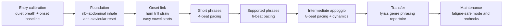
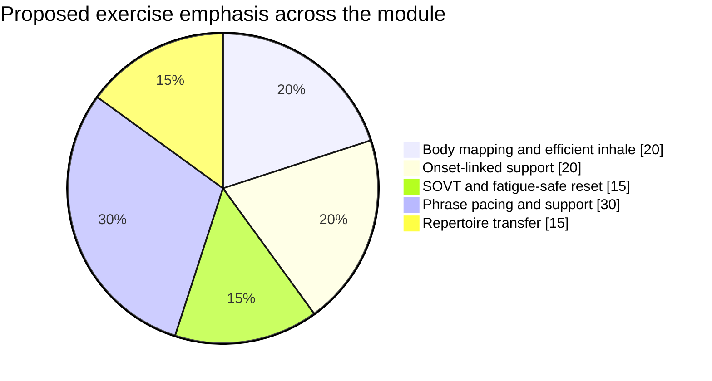

# v8 Imported Research Source

> **v8 source status — SOURCE_RECOVERY_REQUIRED:** 이 원본은 내용 보존용이다. 본문의 `turn...` 임시 인용은 대화 세션 종속 참조로 프로젝트 외부에서 재현되지 않는다. 주요 설계 결론은 canonical 커리큘럼에 반영했지만, 개별 주장 인용은 출처 복구 전 권위 근거로 사용하지 않는다.

- 원본 파일: `3. Breath & Support #Ub9ac#Uc11c#Uce58.md`
- canonical 역할: `03-breath-support.md`

---

# Breath and Support Module Design for Universal Vocal Core

## Executive summary

A strong Breath & Support module for **Universal Vocal Core** should not teach “more air” as the goal. It should teach **phrase-fit inhalation, efficient rib–abdominal expansion, stable pressure/flow during phonation, coordinated onset, and stylistically appropriate phrase pacing**. This is consistent with current science-informed pedagogy: NATS defines breath management as coordination of respiratory pressure and flow with phonation and resonation to achieve the intended musical result efficiently and sustainably, while official NATS pedagogy materials distinguish **breathing** from **what the singer does with the air once inhaled**. Appoggio is best framed not as a mystical “support feeling,” but as a coordinated, whole-system management strategy involving inspiratory and expiratory forces for optimal phonation. citeturn9view3turn10view2turn10view0turn9view4

For adult learners across genres, the module should separate **shared physiology** from **stylistic output**. The physiology of efficient inhalation, onset, and flow control is transferable; the amount of breath used, phrase lengths, and “speech-likeness” differ by style. Research and pedagogy reviews show that classical singers often begin phrases at substantially higher lung volumes than speech, but not necessarily at maximal inhalation; a large body of work also shows style-specific breathing strategies, and recent NATS scholarship argues that core bel canto principles remain relevant when adapted to contemporary, science-informed pedagogy rather than copied as genre-specific dogma. citeturn24view0turn24view1turn33view0turn33view1

Beginner training should therefore focus on **awareness, quiet inhale, anti-clavicular efficiency, easy onset, and very short phrase pacing**. Intermediate training should add **appoggio-like management during longer phrases, dynamic shaping, pitch jumps, and repertoire transfer**. Messa di voce and more explicit appoggio work belong later, because they require finer coordination of breath, onset, and resonance; NATS-related scholarship treats messa di voce as both an appoggio-linked skill and a useful readiness/health assessment. citeturn10view3turn13view4turn12view2

The app should provide **clear, bounded, non-diagnostic feedback**. It can reliably coach timing, phrase completion, onset timing, obvious prephonatory breathiness, tempo alignment, and—if optional sensors are available—gross thoraco-abdominal motion. It should **avoid** claiming that it can “see the diaphragm,” diagnose pathology, or judge “good support” from microphone audio alone. Real-time visual feedback can help, but dense knowledge-of-results during performance can interfere with learning, especially in novices, so the app should prefer **brief real-time cues plus stronger post-trial summaries**. Built-in mics also have limitations: they do not represent breaths well and may be too noisy for precise, universal acoustic judgment without calibration. citeturn17view5turn17view4turn13view6turn29view0

When users are tired or hoarse, the module should switch to a **fatigue-safe mode**: relative voice rest, hydration prompts, humidification advice, reduced speaking/singing load, and only **gentle, comfortable SOVT or resonant-voice tasks** if there is no pain, aphonia, or worsening hoarseness. Official medical sources recommend voice rest, hydration, and humidification for overuse-related hoarseness, and ASHA and NHS/CUH materials support gentle SOVT tasks such as cup-bubbles/straw phonation. Persistent hoarseness, pain, breathing/swallowing difficulty, or blood require medical referral rather than app drilling. citeturn9view9turn9view10turn29view0turn9view11turn2search4

## Pedagogic analysis and direct design answers

**What are the practical goals of breath training in singing?**

The practical goals are not “bigger lungs” or dramatic abdominal movement. They are to help learners take **the amount of air the phrase actually needs**, produce a stable and appropriate airflow/pressure relationship for the intended style, coordinate the start of breath with the start of tone, maintain phrase continuity, reduce unnecessary neck/shoulder effort, and improve endurance and vocal health. NATS describes breath as the air supply required for optimal phonation, and science-informed NATS terminology defines breath management as coordinated pressure-and-flow control for efficient, sustainable artistic output. ASHA’s physiologic voice-therapy framework similarly targets efficient airflow–vocal fold–supraglottic coordination and the “strongest, cleanest” voice with the least effort. citeturn9view3turn10view2turn29view0

A useful app design implication follows: **breath training should be evaluated through outcomes**, not through exaggerated torso choreography. Outcomes include whether the learner can start clearly, sustain evenly, finish phrases without collapse, and repeat the task consistently. Professional singing studies show repeatable, phrase-specific respiratory strategies rather than one universal visible pattern, and NATS scholarship explicitly warns that “support” language can become vague or harmful when treated as a single sensation everyone must copy. citeturn17view0turn13view5turn13view6turn34view0

**How should beginner breathing training differ from intermediate phrase support?**

For beginners, breathing work should be **low-complexity and low-cognitive-load**. The goal is to replace clavicular or grabbed inhalation with quiet rib–abdominal expansion, introduce easy onset, and build the idea that the breath amount depends on the upcoming task. Cleveland’s synthesis of breath-management research shows clear style differences, while Erickson’s 2022 analysis argues that inhalation depth is adjusted to anticipated vocal duration, not the other way around. That means beginners should be taught **task-matched inhalation**, not “always take a full breath.” citeturn24view1turn34view0

For intermediate learners, the focus shifts from “where do I breathe?” to **“how do I manage the breath already taken?”** Here appoggio becomes useful as a practical concept: maintaining a buoyant inspiratory posture while the phrase unfolds, avoiding rib-cage collapse, linking onset and flow, and learning phrase-dependent pacing. Voice Science’s model of appoggio as antagonistic interaction between inspiratory and expiratory muscles, NATS’s definition of appoggio as a strategy that optimizes laryngeal efficiency, and recent bel canto scholarship all support treating appoggio as an integrated phonatory system rather than a single abdominal action. citeturn9view4turn10view0turn33view0turn33view1

A practical curriculum split is:

- **Beginner**: body mapping, quiet inhale, anti-shoulder habit, brief voiceless pacing, simple onset-linked voicing, 4-beat phrase work.
- **Intermediate**: phrase planning, 6- and 8-beat work, dynamic shaping, pitch-jump stability, short messa di voce, and transfer into style-specific repertoire.

That sequencing is supported by the pedagogic literature linking appoggio and messa di voce to more refined expressive singing rather than first-contact technical correction. citeturn13view4turn12view2

**How should phrase-training lessons be designed for 4-, 6-, and 8-beat phrases?**

Phrase training should progress by **beat length, tempo stability, text density, and dynamic demand**, in that order. The app should keep pitch range easy at first and increase only one variable at a time. Studies of professional singers show phrase-specific consistency in lung volumes and respiratory transitions, which supports designing lessons around repeatable phrase templates rather than abstract “support” drills. Historical/pedagogic sources also tie breathing to punctuation and text logic, so phrase work should always move quickly from neutral syllables to small text units. citeturn24view0turn24view1turn21search2

| Phrase length | Initial lesson design | Intermediate expansion | Suggested objective success gate |
|---|---|---|---|
| **4 beats** | One pitch or 3-note cell, one syllable per beat, tempo 60–72 bpm, silent inhale over 2 beats then phonate over 4 | Add consonant-dense text, stepwise melodic motion, soft-to-medium dynamic arc | 5 of 6 correct reps with no shoulder lift, no extra breath, onset aligned within one beat subdivision, effort ≤3/10 |
| **6 beats** | Two 3-beat feet or one 6-beat line on /vu/ or /mi/, tempo 60–72 bpm | Add one leap, add text, then add medium dynamic contrast | 4 of 5 reps with even phrase contour, no audible gasp before onset, phrase end not dropping more than ~6 dB |
| **8 beats** | Comfortable pitch range, mostly stepwise melody, sustain or legato text, tempo 56–68 bpm | Add pitch leaps, vowel changes, then style transfer | 4 of 5 reps with single breath, stable onset, phrase pacing intact, recovery breath quiet and efficient |

These thresholds are **proposed app gates**, not lab norms; they should be tuned in beta testing. The research basis is that phrase initiation is phrase-specific and consistent in trained singers, not maximized indiscriminately, while onset detection and rhythm tracking are technically feasible in real time from singing audio. citeturn24view0turn17view0turn19view4

**How can the app prevent the misconception of “take a big breath”?**

This misconception should be prevented in **language, visuals, and scoring logic**.

The pedagogic and physiological evidence is clear enough to justify avoiding “big breath” as default instruction. Professional classical singers often initiate phrases around the **70% vital-capacity area**, with half of phrases in one study beginning between **62% and 79% VC**, not at 90%–100% VC. Cleveland specifically notes that maximal inhalation increases recoil forces and discomfort; Erickson further argues that overbreathing and breath stacking can make singing harder, not easier, because hyperinflation and retained CO₂ can increase respiratory drive and effort. citeturn24view0turn24view1turn34view0

The module should therefore replace “big breath” with these three cues:

- **“Take the breath this phrase needs.”**
- **“Quiet inhale, easy ribs, no shoulder grab.”**
- **“Finish the exhale enough to reset before the next inhale.”**

The UI should also avoid full-lung graphics for short phrases. A better pattern is a **phrase-fit breath gauge** that targets small, medium, or large inhalations depending on phrase length and text density. If optional motion sensing is available, the app can detect over-large inhalations relative to task length and prompt: “That inhale was larger than needed for this 4-beat phrase—try a calmer reset.” This is more defensible than saying the user’s support is “wrong.” citeturn34view0turn13view6

**What feedback can the app provide, and what should it avoid?**

The app can provide useful feedback about **timing, consistency, and overt acoustic behavior**. ASHA describes biofeedback as external monitoring that helps users make real-time adjustments in pitch, loudness, quality, effort, respiration, and body position. Modern signal-processing research also supports accurate singing onset/offset detection in real time, and smartphone / wearable IMU research supports respiratory-rate and gross chest–abdomen movement estimation. citeturn29view0turn19view4turn19view1turn19view2

What the app should provide:

- task-matched inhale timing
- breath-mark adherence
- onset timing and obvious prephonatory air leakage
- phrase completion and end-of-phrase collapse
- tempo-aligned exhale pacing
- gross rib/abdomen excursion patterns if sensors exist
- self-report prompts for effort, dryness, fatigue, pain

What the app should avoid:

- diagnosing laryngeal pathology from consumer audio
- telling users they are “using the diaphragm correctly”
- equating one torso pattern with “good support”
- giving dense moment-by-moment visual scoring to novices on every attempt
- instructing forceful abdominal pushing or maximal inhalation
- interpreting built-in phone mic data as precise airflow without calibration

Two studies are especially important here. Wilson et al. found that real-time visual feedback can **reduce immediate performance accuracy while it is being displayed**, even if post-intervention learning improves. Erickson’s app-biofeedback review also notes that breaths may not be represented and that built-in microphones can be too noisy for accurate analysis in some cases. citeturn17view5turn17view4

**Which breathing exercises are safe or allowed when tired or hoarse?**

If a singer is merely **tired** but has no pain, aphonia, or worsening hoarseness, the safest app content is **gentle reset work**: quiet rib–abdominal breathing, very light cup bubbles or straw phonation, lip trill, light humming, and easy resonant-voice patterns at comfortable pitch and low-to-medium intensity. ASHA endorses SOVT and resonant-voice approaches because they can improve efficiency and reduce vocal-fold impact; CUH’s patient protocol uses gentle bubbles, then voiced “oo,” then pitch glides, explicitly warning against strain. Korean telepractice evidence also showed improvements in vocal fatigue scores using a self-care program that included laryngeal massage and straw phonation in water. citeturn29view0turn9view11turn27view1turn28view2

If the user is **hoarse**, the app should first triage. NIDCD and Mayo advise voice rest, hydration, and humidification for overuse-related hoarseness and warn against prolonged loud speaking/singing; persistent hoarseness beyond roughly **2–4 weeks**, serious change lasting more than a few days, pain, blood, breathing difficulty, or swallowing difficulty should trigger medical referral. NATS’s voice-rest review also supports relative voice rest for most inflammatory/infectious laryngitis and notes that controlled, low-impact resonant-type exercise may have value in some acute injury situations, but those are not cases for aggressive self-guided breath drills. citeturn9view9turn9view10turn2search4turn30view0

Accordingly, the app should classify the following as **allowed only in fatigue-safe mode**:

- silent breathing awareness
- gentle cup bubbles / straw phonation
- light lip trill or nasal hum
- easy resonant chant or hum-to-vowel
- hydration / humidification / voice-rest guidance

And the following as **not allowed in fatigue-safe mode**:

- long hiss endurance drills
- repeated breath holds
- loud sustained high notes
- abdominal pulses / cough-like drills
- belting tasks
- dense onset repetition
- any drill causing pain, dizziness, or worsening hoarseness

**What are objective progression criteria to advance learners?**

Progression should be based on **task success, repeatability, and low effort**, not on one “perfect feeling.” The most defensible objective gates are:

- phrase completion rate
- onset timing / stability
- audible prephonatory air leakage
- obvious shoulder-lift or clavicular compensation
- breath-mark accuracy
- end-of-phrase SPL collapse
- self-rated effort/fatigue
- next-day symptom change
- optional MPT-style endurance only as a secondary metric, not the main criterion

ASHA uses explicit maximum-phonation-time goals in some therapy contexts, but for singing pedagogy the more ecologically valid progression test is whether a given phrase can be repeated with stable timing and low effort. Professional singing research supports phrase-specific repeatability, and current onset-detection algorithms make automated onset/offset scoring feasible with low delay. citeturn29view0turn17view0turn19view4

A practical advancement rule for the app is:

**Advance only if the learner passes both performance and health gates**:  
performance gate = success on at least 80% of trials for the current phrase family;  
health gate = effort ≤3/10, no pain, no dizziness, no next-day increase in hoarseness or fatigue.

That rule is a design inference, but it is aligned with official voice-therapy emphasis on dosage, effort reduction, and safe monitoring. citeturn29view0turn9view9turn9view10

## Progression architecture and sensor strategy

Because platform and sensor constraints were left open, the safest recommendation is a **tiered architecture**:

- **Core tier**: iOS and Android with built-in microphone only
- **Enhanced tier**: microphone + smartphone IMU session mode, with the phone placed on upper sternum or upper abdomen during selected setup drills
- **Advanced tier**: microphone + Bluetooth rib/abdomen/back wearable belt with pressure or IMU sensing

This tiering is well aligned with the current technical literature. Smartphone IMU methods can estimate respiratory kinematics under guided conditions; multi-IMU systems can estimate respiratory rate in static and dynamic conditions; and a singing-specific tutoring interface has already shown that a pressure-sensor belt over ribs, abdomen, and back can support real-time breath guidance. At the same time, mobile singing-biofeedback literature shows that built-in microphones are not always accurate enough for every advanced judgment, so audio-only mode should stay conservative in its claims. citeturn19view2turn19view1turn32view1turn17view4

*The progression emphasizes phrase-linked breathing rather than isolated breath mechanics, consistent with task-matched inhalation, phrase-specific repeatability, and the need to keep “support” language operational rather than vague.* citeturn34view0turn17view0turn13view6

*This weighting reflects the evidence that breathing must be linked quickly to phonation and phrasing, not taught as a standalone breathing-fitness program.* citeturn9view3turn10view2turn24view1

### Feedback types and recommended sensors

The table below summarizes what the app can measure responsibly, what sensor tier is needed, and what should remain coach-only or prompt-only. Acoustic metric families such as CPP, HNR, spectral slope, jitter, shimmer, SPL, and voicing time are well established in voice analysis; real-time onset detection is feasible; chest/abdomen motion can be estimated with IMUs or pressure belts. But because those signals do not directly reveal inner muscular intent, the UI should present learner-facing feedback as **descriptive, not diagnostic**. citeturn9view5turn19view4turn19view1turn19view2

| Feedback type | Primary sensor tier | Useful metrics | Good learner-facing use | Feedback to avoid |
|---|---|---|---|---|
| Inhale timing and quietness | Audio-only; optional IMU | Inhale duration, pre-onset noise, timing to beat | “Your inhale was late / noisy for this phrase.” | “You inhaled incorrectly from your diaphragm.” |
| Anti-clavicular breathing | IMU session mode or wearable belt | Upper-chest acceleration peak, shoulder-lift proxy | “Try less upper-chest lift; keep the neck easier.” | Precise claims about specific muscles |
| Rib–abdominal expansion pattern | Wearable belt best | Thorax/abdomen excursion, asymmetry, phase pattern | “This rep showed more lower-rib motion than the last.” | “This is the one correct support pattern.” |
| Onset linkage | Audio-only | Onset latency, prephonatory noise, abruptness proxy | “The sound began with extra air; try hum-to-vowel.” | Pathology labels such as “vocal fold problem” |
| Phrase completion | Audio-only | Phrase duration, extra-breath events, voicing continuity | “You completed the 6-beat phrase in one breath.” | Generic “more support!” after every error |
| End-of-phrase pacing | Audio-only | End-of-phrase SPL drop, pitch drift, breath burst | “The phrase faded early; try a calmer, slower release.” | “Push more abs at the end.” |
| Dynamic support | Audio + optional belt | SPL contour, pitch stability under crescendo/decrescendo | “The swell stayed even; repeat at lower effort.” | Raw acoustics with no interpretation |
| Fatigue / safety | Self-report mandatory | Effort, dryness, pain, fatigue, next-day change | “Switching to fatigue-safe mode is recommended.” | Any automated claim that the voice is “injured” |
| Coach dashboard only | Audio + optional wearables | CPP, HNR, spectral slope, long-term trend data | Hidden analytics for teachers/SLPs | Raw novice-facing jitter/shimmer scores |

A crucial design rule follows from the feedback literature: **novices should see less real-time detail than intermediates**. Real-time cues should be sparse and action-oriented; deeper analytics belong in the after-trial summary or coach dashboard. citeturn17view5turn17view4

## Draft lesson module

The lesson draft below proposes **30 lessons** in three arcs: foundation, beginner appoggio/onset, and intermediate phrase support/transfer. A sensible default length is **10–12 minutes per lesson**, with an optional extension block if effort stays low and no next-day symptoms worsen. That brief format is compatible with telepractice/self-practice research showing stronger adherence when guided home practice is simple and supported, while ASHA also emphasizes that dosage should be individualized. citeturn28view1turn29view0

**Global safety rules for all lessons**

If the user reports or shows **pain, dizziness, coughing fits, breathlessness out of proportion to effort, aphonia, or worsening hoarseness**, the lesson should stop immediately and switch to recovery guidance. If hoarseness persists, or if there is breathing/swallowing trouble or blood, the app should refer out rather than continue training. Relative voice rest, hydration, and humidification are preferred over forcing drills through symptoms. citeturn9view9turn9view10turn2search4turn30view0

| Lesson | Objective | Core exercises | Repetitions / durations | Feedback type | Safety criteria |
|---|---|---|---|---|---|
| 1 | Establish baseline and safety | Quiet breathing scan; spoken count to 4; sung single pitch for 4 beats | 3 scans; 3 spoken; 3 sung trials | Post-trial audio summary + self-rating | Stop if dizzy, painful, or breathless |
| 2 | Introduce quiet phrase-fit inhale | Silent inhale for 2 beats, release for 4 beats with no phonation | 8 reps | Real-time inhale timer + post summary | Shorten inhale if neck or shoulder effort appears |
| 3 | Map rib–abdominal expansion | Hands on lower ribs and upper abdomen; inhale–release cycles | 8 reps of 2-in / 4-out | Animated rib/abdomen cue; self-check | No forced abdominal push |
| 4 | Reduce clavicular habit | “Low easy inhale” with shoulder-still cue | 6 reps + 3 spoken transfers | IMU shoulder-lift warning if available; otherwise self-video cue | End lesson if repeated tension triggers frustration or hyperventilation |
| 5 | Start breath pacing without phonation | Gentle hiss for 4 beats after quiet inhale | 6–8 reps | Beat ring + phrase length score | No long or forceful hiss |
| 6 | Link breath to easy onset | Hum /m/ to vowel release on beat 1 | 8 reps | Onset timing + audible-air flag | Stop if throat feels scratchy or pressed |
| 7 | Build steady short phonation | Sustained /u/ or /o/ for 4 beats at easy pitch | 6 reps | Phrase completion + end decay | Comfortable pitch only |
| 8 | Introduce SOVT airflow shaping | Straw bubbles without voice, then gentle voiced “oo” | 10 unvoiced + 10 voiced reps | Bubble steadiness + comfort prompt | No strain; room-temp water; stop if coughing |
| 9 | Add pitch glide in SOVT | Straw “oo” low–high, high–low | 6 up/down glides | Smoothness score + comfort rating | Keep range narrow and easy |
| 10 | Transfer SOVT ease to open phonation | Straw out, repeat easy /u/ on same pitch | 6 straw + 6 open reps | Compare before/after onset and steadiness | No louder than medium |
| 11 | Beginner appoggio setup | Quiet inhale, brief release pause, easy vowel onset | 8 reps | Timing cue + “don’t rush the onset” message | Pause should be brief, not a long hold |
| 12 | Stabilize lower-rib buoyancy | 4-beat phrase on /vu/ with no torso collapse | 6 reps | End-of-phrase trace + self-rating | Avoid abdominal bracing |
| 13 | Improve consonant-vowel onset | /mi/, /na/, /vo/ patterns on 4 beats | 8 short patterns | Onset quality + syllable timing | If aspirate onset worsens, return to hum |
| 14 | Short phrase repetition | 4-beat melodic cells, one breath each | 5 sets of 3 cells | Post-set phrase success score | Keep tessitura central |
| 15 | Introduce phrase punctuation | Mark one breath point in a two-cell phrase | 6 phrase loops | Breath-mark adherence + text cue | No gasping between phrases |
| 16 | Quick silent renewal | One 4-beat phrase, 2-beat renewal, repeat | 6 loops | Renewal timing + inhale noise check | Stop if light-headed |
| 17 | Extend pacing to 6 beats | Hiss or /vvv/ for 6 beats, easy tempo | 6 reps | Beat pacing + steady-release score | No forceful exhale |
| 18 | First 6-beat voiced phrases | Single pitch then 3-note pattern on /u/ | 5 sets of 2 phrases | Phrase completion + pitch stability | Medium volume max |
| 19 | Add one melodic leap | 6-beat phrase with one 3rd or 4th leap | 6 reps | Onset after leap + end stability | Reduce range if pressed |
| 20 | Add simple text to 6 beats | Short lyric phrase, one syllable per beat | 6 reps | Text intelligibility + phrase pacing | If diction causes tension, return to neutral syllables |
| 21 | Intermediate appoggio and dynamic shape | 4-beat soft–medium–soft swell on one pitch | 6 reps | SPL contour + effort check | No fortissimo, no pressed attack |
| 22 | 6-beat dynamic phrase | Same phrase with medium crescendo then release | 5 reps | Dynamic contour + end-of-phrase control | Stop if throat stiffens |
| 23 | 8-beat pacing without text | /vu/ or /nu/ phrase at easy pitch | 5 reps | One-breath completion + pacing | Tempo moderate, not slow-motion strain |
| 24 | 8-beat legato with text | Vowel-forward text on stepwise melody | 5 reps | Breath-mark adherence + phrase line | No extra breath mid-phrase |
| 25 | Phrase breathing from punctuation | Mark breaths in a two-line lyric based on punctuation and sense | 4 read-and-sing cycles | Planning score + breath placement feedback | No breathing in mid-word |
| 26 | Style contrast | Same phrase, one speech-like and one sustained version | 4 pairs | Comparative playback + teacher notes optional | Keep both in healthy comfort zone |
| 27 | Pitch-jump support | 6- or 8-beat phrase with one larger leap | 5 reps | Onset after leap + pitch landing | Reduce interval if pushing |
| 28 | Fatigue-safe reset lesson | Cup bubbles, lip trill, resonant hum only | 5–7 minutes total | Comfort-only mode; no performance scoring | Use only when mildly tired, not acutely ill/painful |
| 29 | Repertoire transfer practice | Selected 4-, 6-, and 8-beat excerpts from favorite songs | 3 excerpts × 3 reps | Transfer summary + which phrase length needs work | Abort any excerpt that provokes strain |
| 30 | Exit assessment and leveling | Baseline recheck, 4/6/8-beat tests, self-reflection | 2 trials each + report | Level recommendation + coach dashboard summary | No max-out attempts |

This sequence is a **design synthesis** grounded in NATS definitions of breathing, appoggio, onset, and SOVT; style-specific lung-volume and respiratory-transition findings; current visual-feedback evidence; and voice-rest / hoarseness guidance. citeturn9view3turn10view0turn10view2turn10view3turn24view0turn24view1turn17view0turn17view5turn29view0turn30view0

## Sample short exercise scripts and repertoire transfer

### Sample app exercise scripts

**Quiet phrase-fit inhale**

**Coach script:**  
“Listen first. This is a short phrase, so you do not need a full breath. Inhale quietly for two beats. Let the ribs widen and the upper body stay easy. Exhale for four beats without pushing.”

**Good UI messages**
- “Nice reset. The inhale matched the phrase.”
- “Quiet shoulders, calmer neck.”
- “Try 10% less air on the next rep.”

**Messages to avoid**
- “Take the deepest breath possible.”
- “Use your diaphragm harder.”
- “Support more.”

Supported by the evidence that phrase length should determine inhalation depth and that overbreathing can make singing harder. citeturn34view0turn24view0turn24view1

**Hum-to-vowel onset**

**Coach script:**  
“Breathe quietly. Start with a gentle hum on the beat. Keep that easy feeling and open to ‘oo’ without adding air.”

**Good UI messages**
- “The note started cleanly.”
- “Less audible air before the sound.”
- “Keep the same easy start on the vowel.”

**Messages to avoid**
- “Close the cords harder.”
- “Attack the note.”
- “Push more air into the sound.”

Supported by NATS terminology on efficient onset and by voice-onset biomechanics distinguishing coordinated, hard, and breathy onsets. citeturn10view3turn18view1

**Straw bubbles in water**

**Coach script:**  
“Blow gentle bubbles. Then add a soft ‘oo’ into the straw. Keep the bubbles steady, not explosive. If the neck tightens, stop and make the sound smaller.”

**Good UI messages**
- “Steady bubbles.”
- “Good front-of-face vibration.”
- “Comfort stayed low-effort.”

**Messages to avoid**
- “Make bigger bubbles.”
- “Longer at all costs.”
- “Push from the abs.”

Supported by CUH and ASHA guidance on SOVT and by Korean self-care / fatigue evidence. citeturn9view11turn29view0turn28view2

**Six-beat phrase pacing**

**Coach script:**  
“Take a quiet breath for the line, not for the whole song. Begin the sound immediately on beat one. Spend the air evenly all the way to beat six.”

**Good UI messages**
- “You finished the line in one breath.”
- “The phrase faded early—use the same amount of air more slowly.”
- “Onset was late by one subdivision; prepare earlier.”

**Messages to avoid**
- “You ran out because you need a bigger breath.”
- “Support harder at the end.”
- “Lock the stomach.”

Supported by phrase-specific professional-singer findings and real-time onset detection feasibility. citeturn17view0turn24view0turn19view4

**Eight-beat text phrase**

**Coach script:**  
“Mark your breath before the sentence begins. This is one thought. Do not breathe in the middle of the word or the idea. Quiet inhale, then keep the line moving.”

**Good UI messages**
- “Breath placement matched the sentence.”
- “Try a smaller inhale with a longer release.”
- “Good one-breath phrasing.”

Supported by historical pedagogy linking breathing to punctuation and by phrase-planning logic in singing pedagogy. citeturn12view2turn21search2

**Fatigue-safe mode**

**Coach script:**  
“Your voice and effort ratings suggest recovery practice today. We’ll switch to gentle bubbles, humming, hydration prompts, and short relative voice rest reminders.”

**Good UI messages**
- “Recovery mode recommended.”
- “Keep today gentle and brief.”
- “If hoarseness worsens or lasts, seek evaluation.”

**Messages to avoid**
- “Push through to build stamina.”
- “A few hard reps will fix it.”
- “Your voice is injured.”

Supported by NIDCD, Mayo, ASHA, and NATS voice-rest guidance. citeturn9view9turn9view10turn29view0turn30view0

### Phrase tasks for repertoire transfer

These are **designed examples**, intended to help learners carry the module into real songs while keeping the physiology stable and the style flexible.

| Transfer target | Example task | Breath focus | Success cue |
|---|---|---|---|
| Classical / legit | 8-beat vowel-led line on “Kyrie eleison” or a simple art-song phrase | Quiet inhale, long release, legato onset-to-line continuity | One breath, even vowel line, no phrase-end collapse |
| Pop ballad | 6-beat pre-chorus line with speech-like consonants | Smaller inhale than the learner expects; efficient release | Text stays clear without gasp or push |
| Musical theatre | 4-beat then 6-beat storytelling lines with crisp diction | Phrase-fit breath and fast silent renewal | Breath does not interrupt the thought or diction |
| Jazz / R&B | 8-beat syncopated line entering off the beat | Breath preparation before off-beat entry | Off-beat onset lands clearly without aspirate start |
| Rock / contemporary commercial | 4-beat hook at medium intensity | Avoid overfilling; coordinate onset before adding drive or edge | Stable hook without neck effort |

A design principle across all genres is that **the app scores physiology and pacing, not genre aesthetics**. Style notes can be layered later by human coaches or genre-specific modules. That approach is supported by the evidence that breathing strategies vary by task and style, while the core objective remains efficient and sustainable phonation. citeturn24view1turn33view0turn33view1

## Evidence summary

| Source | Type | High-value finding | Module implication |
|---|---|---|---|
| NATS Music Theater resources citeturn9view3 | Official pedagogy | Breath provides the air supply for optimal phonation; breathing and “support/balance” are not the same | Teach inhale and management as separate but linked skills |
| NATS Science-Informed Terminology citeturn10view0turn10view2turn10view3turn10view4 | Official pedagogy reference | Defines breath management, appoggio, onset, and SOVT in science-informed terms | Use operational language and avoid vague metaphors |
| Voice Science appoggio lexicon citeturn9view4 | Official pedagogy / science communication | Appoggio is coordinated inspiratory–expiratory management for optimal phonation | Translate appoggio into progressive, measurable tasks |
| Thomasson & Sundberg lung-volume data citeturn24view0 | Peer-reviewed / research report | Half of phrases began between 62–79% VC; mean initiation about 70% VC | Reject “always take a maximal breath” |
| Cleveland on classical vs nonclassical breathing citeturn24view1 | Pedagogy synthesis in NATS | Style affects lung-volume use and respiratory transitions; classical and country strategies differ | Build genre-transferable mechanics, not genre-identical breaths |
| Salomoni et al. PLOS One citeturn17view0turn23search6 | Peer-reviewed | Trained singers show distinct respiratory kinematics and repeatability | Use repeatable phrase templates and consistency metrics |
| Hoch on bel canto in modern pedagogy citeturn33view0turn33view1 | NATS scholarship | Core bel canto principles remain adaptable beyond the classical canon | Keep appoggio/bel canto principles, but modernize language and application |
| Erickson on overbreathing and predictive inhalation citeturn34view0 | NATS scholarship | Inhalation depth is adjusted to expected vocalization length; overbreathing can worsen ease | Phrase-fit breath gauge and anti-stacking prompts |
| Wilson et al. on visual feedback citeturn17view5 | Peer-reviewed | Real-time VFB may impair immediate performance but improve post-intervention learning | Use sparse real-time cues; rely more on after-trial summaries |
| Erickson on mobile apps and biofeedback citeturn17view4 | NATS scholarship | Biofeedback can help, but breaths are not represented well and built-in mics may be limiting | Be conservative with audio-only claims; recommend optional external hardware |
| ASHA Voice Disorders portal citeturn29view0 | Official clinical guidance | Supports resonant voice, VFEs, SOVT, posture, biofeedback, and individualized dosage | Use SOVT/resonant tasks and self-report-based safety gates |
| NIDCD and Mayo hoarseness guidance citeturn9view9turn9view10turn2search4 | Official medical guidance | Hoarseness management includes hydration, humidification, voice rest, and referral for red flags | Add fatigue-safe mode and clear referral triggers |
| NATS Voice Rest review citeturn30view0 | Official pedagogy / laryngology review | Relative rest is usually preferable; low-impact resonant-type exercise may be clinically useful in some contexts | Do not prescribe aggressive drills during hoarseness |
| Korean self-voice health care study citeturn27view1turn28view2 | Korean peer-reviewed source | Video-guided self-care including straw phonation improved vocal-fatigue measures | Supports short guided recovery content inside the app |
| Smartphone / IMU / wearable studies citeturn19view1turn19view2turn32view1 | Sensor research | Respiratory motion can be estimated with phones, IMUs, or belts; singing tutoring can combine pitch and breath feedback | Build a three-tier sensor architecture rather than assuming full hardware availability |

Overall, the strongest evidence base for this module comes from **official NATS/ASHA/NIH-style sources plus peer-reviewed singing and voice-therapy studies**. The clearest design conclusion is that a successful Breath & Support module should teach **less air, better timing, easier onset, steadier pacing, and safer recovery**, not “bigger breaths” or rigid abdominal choreography. citeturn9view3turn10view2turn34view0turn29view0