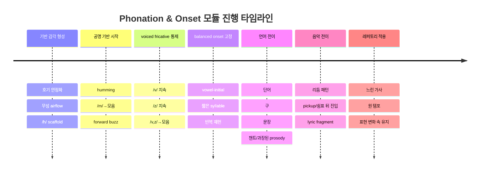

# v8 Imported Research Source

> **v8 source status — SOURCE_RECOVERY_REQUIRED:** 이 원본은 내용 보존용이다. 본문의 `turn...` 임시 인용은 대화 세션 종속 참조로 프로젝트 외부에서 재현되지 않는다. 주요 설계 결론은 canonical 커리큘럼에 반영했지만, 개별 주장 인용은 출처 복구 전 권위 근거로 사용하지 않는다.

- 원본 파일: `4. Phonation & Onset #Ub9ac#Uc11c#Uce58.md`
- canonical 역할: `04-phonation-onset.md`

---

# Universal Vocal Core를 위한 Phonation & Onset 모듈 설계 보고서

## 요약

이 모듈의 핵심 목표는 학습자가 **균형 잡힌 발성 balanced phonation**, **쉬운 시작 easy onset**, 그리고 **pressed phonation 회피**를 안전하게 구별하고 재현하도록 돕는 것입니다. 음성과학 문헌에서 onset은 성대 진동이 시작되어 안정된 진동으로 이행하는 “임계 구간”으로 다뤄지며, 일반적으로 **breathy aspirated**, **balanced coordinated**, **hard pressed**의 세 범주가 구분됩니다. 이 범주는 교육적으로 유용하지만, 실제 음성 산출은 연속체이며 장르·음량·발화 맥락에 따라 미세하게 달라집니다. 따라서 앱은 “정답 라벨러”가 아니라, 학습자가 **청각·감각·반복성**을 근거로 스스로 판별하는 구조를 가져야 합니다. citeturn8view8turn16search2turn20view1

근거를 종합하면, 초보자와 중급 초입 학습자는 onset에서 가장 흔히 **공기와 성대 접촉의 타이밍 불일치**, **숨을 먼저 쏟아 버려 breathy해지는 문제**, **강하게 붙이려다 pressed/hard onset으로 가는 문제**, **말/연습에서는 되지만 구·문장·노래 진입에서 무너지는 문제**를 겪습니다. 약한 성대 접촉은 불완전한 성문 폐쇄와 증가된 난류를 만들어 breathy하고 약한 소리를 유발할 수 있고, 반대로 성대를 “강한 소리”를 위해 쉽게 과도하게 누르면 airflow가 제한되어 pressed 양상이 생길 수 있습니다. citeturn8view9turn10view1turn20view2

안전 설계의 관점에서, 앱은 세 onset을 **모두 경험하게 하되 대칭적으로 훈련하면 안 됩니다**. breathy와 hard onset은 **대조 지각을 위한 짧은 체험**으로만 쓰고, 연습량의 대부분은 **균형 onset·resonant voice·flow phonation·SOVT**에 배정해야 합니다. Hard/pressed 양상은 충돌 압력과 반복 스트레스의 관점에서 phonotrauma와 연결되며, hard glottal attack은 양성 병변과 관련된 행동으로 오래부터 문제시되어 왔습니다. 따라서 앱은 hard onset을 “효과적인 테크닉”이 아니라 **지각 대비 기준점**으로 제한해야 합니다. citeturn25view1turn14search0turn8view12

교수-학습 순서는 임상 음성치료와 공명·SOVT 문헌이 제시하는 계층과 일치하게, **무성 호기 감각 → humming/nasal → /v, z/ 같은 voiced fricatives → vowel onset → 단음절 → 단어 → 구 → 문장 → 대화/가사**로 설계하는 것이 가장 타당합니다. ASHA는 resonant voice therapy가 “easy phonation”을 기본 speech gesture에서 conversation까지 계층적으로 확장한다고 설명하며, 임상 계층 문헌은 sustained phonation에서 speech로의 난이도 상승을 강조합니다. /m/ humming과 /v, z/ voiced continuants는 부드러운 oral semi-occlusion과 “앞쪽의 buzzy sensation”을 제공하는 전형적 도구로 널리 사용됩니다. citeturn20view1turn20view2turn21search1turn32view0

앱 UX는 **녹음–즉시 재생–블라인드 A/B 비교–짧은 자기평정–반복 녹음**의 루프가 가장 적합합니다. 음악교육 및 보이스 테라피 앱 연구는 녹음 재생이 자기평가 정확도와 메타인지 습관을 높일 수 있음을 보여 주고, 모바일 지원은 숙제 수행량과 순응도를 높일 수 있습니다. 특히 오디오 비교 도구는 **듀얼 재생, 녹음, waveform 시각화**를 핵심 기능으로 설계되었고, 반복 재청취는 학습자가 “처음엔 못 들었던 문제”를 나중에 인식하게 했습니다. 다만 AI는 보조적 설명에는 도움을 줄 수 있어도, 학습자의 개별 차이를 충분히 반영하지 못할 수 있고, 반성적 자기평가 없이 AI만 제공하는 것은 메타인지 향상에 충분하지 않았습니다. citeturn7view0turn13view2turn12search0turn12search1turn12search5

이 보고서의 결론은 명확합니다. Universal Vocal Core의 Phonation & Onset 모듈은 **“성대를 어떻게 해야 하는지”를 직접 조종하게 만드는 해부학 중심 모듈**이 아니라, **“어떤 소리가 나고, 어떻게 느껴지고, 얼마나 쉽게 반복되는지”를 탐지하게 만드는 감각-청각-운동 학습 모듈**이어야 합니다. 용어와 큐는 외부 초점 external focus를 우선하고, 위험 문구는 배제하며, self-assessment는 AI 자동 라벨링 대신 **anchor exemplar, blind A/B, Likert 자기평정, 지연 재청취, 반성 노트**를 조합하는 것이 바람직합니다. citeturn28view0turn7view0turn13view4

## 설계 원칙

### balanced phonation과 easy onset의 작업 정의

이 모듈에서 **balanced phonation**은 성대 접촉과 공기 흐름이 서로 과하지도 부족하지도 않게 조정되어, 시작 순간에 지나친 공기 누출도 없고 폭발적 충돌도 없는 상태로 정의하는 것이 적절합니다. Titze는 flow phonation을 “effortless and efficient”한 산출로 설명하면서도 더 많은 airflow를 “최대화”하는 것이 아니라 **최적화**해야 하며, 과도한 흐름은 breathy하고 약한 소리를 만든다고 명확히 경고합니다. 반대로 성대를 눌러 더 강한 소리를 만들려는 시도는 airflow를 제한해 pressed 양상을 만들 수 있습니다. citeturn10view0turn10view1

ASHA는 resonant voice therapy를 “easy phonation” 속에서 앞쪽의 oral vibratory sensation을 이용해 **가장 강하고 가장 깨끗한 voice를 최소 effort와 최소 impact로** 얻는 접근으로 설명합니다. 즉, pedagogical module의 중심 지표는 “더 세게 붙인다”가 아니라 **깨끗함, 용이함, 반복 가능성, low impact**가 되어야 합니다. citeturn20view1turn20view2

음성과학적으로 onset은 공기 흐름과 성대 상태가 안정 진동으로 들어가기까지의 과정이며, 최근 리뷰는 soft coordinated, hard, breathy aspirated의 세 큰 범주를 재확인합니다. 따라서 앱은 세 범주를 **지각적 대비**로 제시하되, 학습 목표는 balanced 영역의 제어력 확보로 설정하는 것이 타당합니다. citeturn8view8turn16search2

### breathy, pressed, balanced의 지각 단서

약한 접촉으로 성문 폐쇄가 불완전하면 난류가 증가해 breathy하고 약한 음질이 나타날 수 있습니다. Zhang의 음성 생성 역학 리뷰는 weakly adducted vocal folds가 incomplete glottal closure와 증가된 turbulent noise를 유발해 breathy and weak quality를 만든다고 설명합니다. citeturn8view9

반대로 pressed/ hard 쪽은 성대 접촉이 과도하거나 pre-phonatory closure가 커져 시작이 압축되고 거칠게 들리며, 충돌 스트레스가 증가할 가능성이 큽니다. 성대 조직 손상과 양성 병변은 반복적인 collision stress 및 shear stress와 연결되어 있고, phonotrauma는 과도하거나 잘 조절되지 않은 perilaryngeal muscle activity와 관련된 vocal hyperfunction과 연관됩니다. citeturn25view1turn4search0

균형 onset은 청각적으로는 **공기 소리가 시작음보다 먼저 새지 않고**, **폭발적 click/attack도 두드러지지 않으며**, **첫 수 주기에서 빨리 안정화되는** 인상으로 가르치는 편이 좋습니다. 이 설명은 hard와 breathy를 각각 회피하면서도 style-neutral한 지각 목표를 제시합니다. citeturn8view8turn10view1

| 유형 | 생리적 경향 | 학습자가 흔히 듣는 것 | 자기평가 핵심질문 |
|---|---|---|---|
| Breathy onset | 접촉이 늦거나 약함, 공기 선행 | “하-” 같은 공기 누출, 흐리고 약함 | **소리 전에 공기 소리가 먼저 들렸는가?** |
| Balanced onset | 접촉과 airflow가 거의 동시에 조정 | 깨끗하고 즉시 안정, 과도한 click 없음 | **공기 누출도 폭발음도 없이 바로 핵심 tone이 시작됐는가?** |
| Pressed/Hard onset | 접촉이 과도하거나 공기에 앞섬 | 딱/꾹/탁 같은 attack, 시작이 조여짐 | **시작이 터지거나 눌리는 느낌이 있었는가?** |

위 표는 onset 리뷰, 호기-성대 접촉 역학, flow phonation 설명을 바탕으로 한 교육용 요약입니다. citeturn8view8turn8view9turn10view1

### 초보자와 중급 초입이 흔히 겪는 문제

**질문 하나에 대한 명시적 답변:** 초보자와 중급 초입이 onset에서 흔히 겪는 문제는 다음 여섯 가지로 정리할 수 있습니다.

첫째, **breath-holding tendency**입니다. ASHA는 stretch-and-flow phonation을 breath-holding tendencies가 있는 사람들에게 사용하며, 연속된 호기가 먼저 안정된 뒤 voicing을 도입한다고 설명합니다. 이는 많은 학습자가 onset 직전에 목과 호흡을 함께 “잡아두는” 습관을 보인다는 임상적 근거입니다. citeturn20view2

둘째, **공기를 먼저 과하게 써버리는 문제**입니다. Titze는 excessive flow가 breathy and weak voice를 만든다고 했고, weak adduction은 incomplete glottal closure와 turbulent noise로 이어질 수 있습니다. 초보자는 ‘편하게’ 하라는 말을 듣고 breathy하게 빠지는 경우가 흔합니다. citeturn10view1turn8view9

셋째, **과도한 adduction 또는 pressed onset**입니다. “강한 소리”를 만들려는 시도로 성대를 쉽게 누르게 되며, 이는 airflow 제한과 pressed 양상을 유발할 수 있습니다. hard glottal attack은 양성 병변과 관련된 행동으로 보고되어 왔습니다. citeturn10view1turn14search0

넷째, **isolated sound에서 sentence/lyric로 전이 실패**입니다. RVT와 flow phonation 문헌이 모두 hierarchy를 전제로 하는 이유가 여기에 있습니다. basic speech gesture에서 conversation으로 넘어갈 때 old habit이 재개되기 쉽습니다. citeturn20view1turn21search1

다섯째, **자기평가의 부정확성**입니다. 실연 직후의 자기판단은 불안, 긴장, 기억 왜곡의 영향을 받기 쉽고, recording playback 후 평정이 달라질 수 있습니다. 음악 퍼포먼스 자기평가 연구는 live 조건과 recorded playback 조건 사이에서 tone, pitch, rhythm 평정이 유의하게 달라질 수 있음을 보여 주었습니다. citeturn13view2turn13view4

여섯째, **해부학 중심 cue가 유발하는 과조절**입니다. attention focus 연구는 외부 초점 external focus가 movement effectiveness, efficiency, form, automaticity에 더 유리하다고 보고하며, internal focus 지시가 압박 상황에서 수행 저하를 부를 수 있음을 시사합니다. 즉 “성대를 붙여” 같은 말은 초보자에게 학습표적보다 과잉개입을 촉진할 위험이 큽니다. citeturn28view0

### 위험 문구와 더 안전한 큐 설계 원리

**질문 넷에 대한 명시적 답변:** 다음과 같은 문구는 위험하거나 모호합니다. 이유는 크게 두 가지입니다. 하나는 **해부학적으로 직접 감지·조절하기 어려운 내부 구조를 과도하게 의식**하게 만든다는 점이고, 다른 하나는 **pressed/hyperfunctional 대체 전략**을 유발할 수 있다는 점입니다. 외부 초점, 결과 중심, 감각·청각 기반 문구가 더 안전합니다. citeturn28view0turn25view1

| 금지 또는 주의 문구 | 왜 위험/모호한가 | 더 안전한 대체 문구 |
|---|---|---|
| “성대를 붙여라” | internal focus이며 초보자는 과내전·목 조임으로 해석하기 쉽습니다. citeturn28view0turn10view1 | “공기 새는 소리 없이 바로 core tone이 시작되게 해보세요.” |
| “목을 닫아라” / “목을 조여라” | pressed/hyperfunctional 패턴을 직접 유도할 수 있습니다. citeturn25view1turn4search0 | “시작을 작고 조용하게, 하지만 또렷하게 해보세요.” |
| “더 세게 시작해라” | hard attack과 loudness를 혼동하게 만듭니다. citeturn14search0turn25view1 | “볼륨보다 시작의 깔끔함을 먼저 맞추세요.” |
| “숨을 밀어 넣어라” | 과도한 airflow로 breathy onset을 만들 수 있습니다. citeturn10view1turn8view9 | “steady outflow 위에 소리가 살짝 올라타게 해보세요.” |
| “가슴으로 눌러라” | 불필요한 effort와 압박 전략을 강화할 수 있습니다. citeturn25view1 | “목이 아니라 소리의 시작 질감에 집중하세요.” |
| “딱 붙여서 시작” | 폭발적 attack을 정답처럼 오해하게 만듭니다. citeturn14search0 | “공기 누출도 click도 없이 동시에 시작.” |
| “목구멍을 열어라/닫아라” 단독 사용 | 의미가 넓고 개인차가 커서 실제로는 jaw, tongue root, pharyngeal squeeze로 대체되기 쉽습니다. citeturn28view0 | “입앞 buzz가 유지된 채 쉽게 시작되는지 들어보세요.” |
| “아무 힘도 쓰지 마라” | 지나친 탈지지로 breathy/unstable onset으로 흐를 수 있습니다. citeturn10view1turn8view9 | “적은 effort로, 하지만 tone core는 유지.” |

실제 앱 cue의 기본 원리는 **external focus first**입니다. Treinkman의 리뷰는 외부 초점 지시가 더 좋은 movement effectiveness와 efficiency를 가져오며, performance pressure 상황에서도 유리할 수 있다고 정리합니다. 따라서 cue는 “body part”보다 “sound result”, “airflow feel”, “buzz location”, “repeatability”에 초점을 맞춰야 합니다. citeturn28view0

### 앱에서 사용할 수 있는 예시 cue phrase

다음 문구는 외부 초점과 auditory target을 우선한 예시입니다. 아래 문구는 근거 기반 설계 원칙을 반영한 제안 문안입니다. citeturn28view0turn20view1turn20view2

| 상황 | 예시 cue phrase |
|---|---|
| breathing-only 준비 | “조용히 공기를 내보내고, 목에서는 아무 일도 일으키지 마세요.” |
| easy onset 도입 | “숨 위에 소리가 살짝 올라타게 시작해보세요.” |
| balanced onset 청각 목표 | “click도, 바람 소리도 없이 바로 tone core가 들리게.” |
| humming | “입술과 코 앞의 작은 buzz를 먼저 찾고, 그 buzz를 잃지 마세요.” |
| /v/ onset | “vvv에서 이미 소리가 켜진 채로 모음으로 미끄러지세요.” |
| /z/ onset | “zzz의 앞쪽 집중을 유지한 채 모음으로 넘어가세요.” |
| pressed 예방 | “더 세게가 아니라 더 쉽게. 시작 질감을 먼저 맞추세요.” |
| phrase transfer | “문장 첫 음만 맞추지 말고, 첫 두 음절의 ease를 함께 들어보세요.” |
| self-check | “이번 take는 ‘쉽게 반복 가능한가’만 평가하세요.” |
| repertoire bridge | “가사로 바꾸어도 hum 때의 buzz와 ease가 남아 있는지 확인하세요.” |

## 안전한 앱 경험 설계

### hard, breathy, balanced onset을 안전하게 경험시키는 방법

**질문 둘에 대한 명시적 답변:** 앱은 세 onset을 모두 경험시킬 수 있지만, **연습 비중과 안전 제약이 달라야** 합니다. 아래 설계는 phonotrauma 위험과 contrastive practice 원리를 바탕으로 한 **안전 설계 추론**입니다. citeturn25view1turn14search0turn23search1

breathy onset 체험은 가장 안전하게 만들 수 있습니다. 무성 호기 → 아주 짧은 /h/+vowel → overt /h/를 점차 줄이는 방식이 적절합니다. ASHA의 stretch-and-flow 설명처럼 **continuous airflow를 먼저 마스터한 다음 voicing을 도입**하는 구조가 안전하며, 문장 수준으로 갈수록 breathiness는 점차 줄입니다. /h/ scaffold는 vowel-initial easy onset을 체감하는 보조장치로는 유용하지만, 최종 목표는 /h/가 들리지 않는 balanced onset이어야 합니다. citeturn20view2turn29search0turn29search4

balanced onset 체험은 모듈의 중심입니다. 가장 좋은 진입은 **hum → vowel**, **/v/ or /z/ → vowel**, **short voiced continuant-loaded word → phrase**입니다. ASHA와 RVT 계층 자료는 humming, voiced/voiceless productions, voiced continuants, phrase, conversation으로의 progression을 제시하며, 특히 /m/과 /v, z/는 “buzzy” 전방 감각을 만들기 쉽습니다. citeturn20view1turn20view3turn32view0

hard onset 체험은 **1-2회의 미니 contrast demo**로만 제한해야 합니다. 낮은 speaking pitch, 작은 음량, 짧은 duration, pain-free 조건, 그리고 즉시 hum 또는 /v/ semi-occluded reset으로 이어져야 합니다. 이유는 hard attack과 collision stress 증가가 phonotrauma와 연결되고, hard glottal attack이 병변 관련 행동으로 보고되어 있기 때문입니다. 따라서 앱 UX는 hard onset을 “연습 스택”에 넣지 말고, **‘이런 질감은 피한다’는 calibration marker**로만 사용해야 합니다. 이 권고는 직접 비교연습과 phonotrauma 근거를 결합한 설계 추론입니다. citeturn25view1turn14search0turn8view12

안전 한계도 분명히 해야 합니다. 앱은 다음 상황에서 즉시 중단 및 전문 평가 안내를 띄워야 합니다: **통증, 갑작스러운 심한 쉼, aphonia, breathing difficulty/stridor, dysphagia, neck mass, 신경학적 증상, 4주 이상 지속되는 변화**. AAO-HNS guideline은 이러한 alarm symptom 또는 4주 경과 시 laryngoscopy/전문의 평가를 강조합니다. citeturn19view0turn18view0

### AI 자동 라벨링 없이 self-discrimination하게 하는 방법

**질문 셋에 대한 명시적 답변:** AI 자동 라벨링 없이도 self-discrimination은 충분히 설계할 수 있으며, 오히려 이 모듈의 목적에는 더 적합합니다. 이유는 세 가지입니다.

첫째, 학습자는 **anchor exemplar**가 있으면 자기평가를 학습할 수 있습니다. 녹음과 재생은 자기평가를 달라지게 만들며, recorded playback 후 tone·pitch·rhythm 평정이 유의하게 달라졌다는 연구는 “실시간 감각”만으로는 자기판단이 불완전하다는 점을 보여 줍니다. 따라서 앱은 hard/breathy/balanced의 예시를 먼저 들려주고, 사용자는 자기 take를 그 예시와 비교하도록 해야 합니다. citeturn13view2

둘째, **reflection이 포함된 audio comparison**은 메타인지를 강화합니다. Li 등의 연구에서 오디오 비교 도구는 recording, dual playback, waveform visualization을 제공했고, 학생들은 반복 청취를 통해 “이전엔 못 들었던 문제”를 발견했습니다. 연구 저자들은 assessment–feedback–reflection–practice cycle을 핵심 모델로 제안했습니다. citeturn7view0

셋째, **AI alone is not enough**입니다. 같은 연구는 AI 대화형 피드백만으로는 충분하지 않고, reflective journals 같은 자기성찰이 중요하다고 지적합니다. 또한 AI-generated feedback은 개별 학습자 차이를 충분히 반영하지 못할 수 있다고 했습니다. 따라서 이 모듈은 AI의 판정 대신, **사용자 스스로 듣고 고르고 기록하는 구조**를 중심에 두는 것이 더 적합합니다. citeturn7view0

실제 self-discrimination 프로토콜은 다음처럼 설계하는 것이 좋습니다. 먼저 **한 번에 한 변수만** 비교합니다. 예를 들어 첫 300ms의 onset만 듣게 하고, 전체 phrase quality는 나중에 평가하게 합니다. 다음으로 “breathy인가?”가 아니라 **구체적 감지 과제**를 제시합니다. “소리 전에 공기가 들렸는가”, “첫 순간에 딱/꾹 하는 transient가 들렸는가”, “첫 두 cycle이 바로 안정되었는가”, “같은 방식으로 세 번 반복 가능한가”처럼요. 이 방식은 label accuracy보다 pattern recognition을 학습시킵니다. citeturn8view8turn13view2turn7view0

### recording, playback, blind A/B를 위한 UX 제안

보이스앱 UX 연구와 학습연구를 종합하면, 녹음과 재생 인터페이스는 “예쁘게”보다 **행동을 유도하고, 비교를 쉽게 하고, 재평가를 습관화하는 것**이 중요합니다. Recorded self-assessment, audio comparison tool, mobile adherence 연구는 각각 playback, dual comparison, mobile practice support의 효과를 지지합니다. citeturn13view2turn7view0turn12search0turn12search1

권장 기능은 다음과 같습니다. **즉시 재생**은 필수입니다. 이어서 **A/B 듀얼 재생**과 **동일 구간 반복 loop**가 있어야 합니다. Li 연구의 오디오 비교 도구는 dual playback/pause와 waveform visualization을 핵심 기능으로 삼았습니다. waveform은 onset 위치, 지속시간, 호흡 전구간의 silence 여부를 거칠게 확인하는 데는 유용하지만, pressed/balanced를 단독으로 판정하는 도구로 제시하면 안 됩니다. 이 부분은 UI 해석 가드레일로 설계해야 합니다. citeturn7view0

**블라인드 A/B 비교**는 강력히 권장됩니다. 사용자가 “전은 나빴고 후는 좋아야 한다”는 기대를 가지면 confirmation bias가 개입하기 쉽기 때문입니다. 직접적인 보컬앱 검증 연구는 제한적이지만, 측정 연구 일반에서 confirmation bias 회피가 중요하다는 점은 명확하며, 자기평가 정확도를 높이기 위해서는 버전명을 숨기고 무작위화하는 설계가 타당합니다. 이는 녹음 자기평가 연구와 bias 회피 원리를 결합한 설계 추론입니다. citeturn13view2turn25view1

또한 **지연 재청취 delayed replay**가 유익합니다. 한 번은 즉시 듣고, 또 한 번은 몇 분 뒤 혹은 다음날 다시 듣게 하면 감정적 몰입에서 조금 벗어난 판단이 가능해집니다. Silveira와 Gavin의 연구에서 2일 후 recorded performance를 대상으로 한 self-assessment는 live 직후 평가와 달랐습니다. citeturn13view2

마지막으로 모바일 practice support는 실제 사용량을 끌어올립니다. van Leer의 연구들은 portable digital media player와 iOS app support가 voice therapy practice와 homework adherence를 증가시킬 수 있음을 보여 줍니다. onset module도 일회성 설명보다 **짧은 반복 루프, reminder, progress streak, saved exemplars**로 설계하는 편이 훨씬 현실적입니다. citeturn12search0turn12search1turn12search5

## 모듈 청사진

### 난이도 상승 구조

**질문 다섯에 대한 명시적 답변:** progressive difficulty는 **호흡 가시화 → semi-occluded/공명 기반 발성 → 모음 onset → 단음절 → 단어 → 구 → 문장 → 리듬/가사 → 레퍼토리** 순으로 설계하는 것이 가장 안전하고 전이성이 높습니다. 이 순서는 ASHA의 resonant voice/flow phonation 설명, voiced continuant hierarchy, 그리고 RTSS 계층 문헌과 정합적입니다. citeturn20view1turn20view2turn21search1turn32view0

### 30레슨 드래프트 모듈

아래 표는 RVT, flow phonation, SOVT, voiced continuants hierarchy, self-recording/self-assessment 연구를 통합해 만든 **설계 초안**입니다. 특히 /m/ humming, /v z/ voiced fricatives, sustained phonation에서 phrase/conversation으로의 progression, negative practice, chant/prosody bridge는 문헌 근거를 직접 반영했습니다. citeturn20view1turn20view2turn20view3turn32view0turn21search1turn7view0

| 레슨 | 목표 | 연습 | 핵심 큐 | 안전 노트 | 평가 |
|---|---|---|---|---|---|
| 1 | 모듈 오리엔테이션 | 증상 체크, baseline 녹음 | “편안한 speaking pitch만 사용” | 통증·breathing issue 시 중단 | 기준 녹음 2개 저장 |
| 2 | 무성 호기 인식 | 4초 조용한 exhale | “목보다 공기 흐름 관찰” | 소리 내지 않기 | airflow 안정 Likert |
| 3 | 호기 시각화 | tissue/손 앞 airflow | “steady outflow” | 과호흡 금지 | 흔들림 최소화 체크 |
| 4 | /h/ scaffold 입문 | hhh + [a e i o u] | “숨 위에 소리 얹기” | 작은 음량만 | 공기 선행 인식 |
| 5 | breathy onset 지각 | 일부러 약간 breathy vs clean 비교 | “차이만 듣기” | 반복 과다 금지 | A/B 구분 |
| 6 | hard onset 지각 | 1–2회의 매우 짧은 contrast demo | “이 질감은 피한다” | 저음·저음량·즉시 reset | hard marker 인식 |
| 7 | humming 시작 | 지속 /m/ | “입술·코 앞 buzz” | 턱 밀기 금지 | buzz 감지 Likert |
| 8 | hum 안정화 | /m/ 3초 sustain | “쉽게, 작게, 안정” | fry로 끝나지 않기 | onset clean 여부 |
| 9 | hum→vowel | m-aa, m-ee, m-oo | “buzz를 잃지 말고 이동” | 편한 범위 | 3회 반복 일관성 |
| 10 | hum 반복 패턴 | ma-ma-ma, mi-mi-mi | “첫 음절과 둘째도 같은 ease” | 속도보다 질감 | A/B 베스트 take 선택 |
| 11 | /v/ 지속 | vvv 3초 | “앞쪽의 가는 buzz” | 치아·입술 과긴장 금지 | /v/ 안정도 |
| 12 | /z/ 지속 | zzz 3초 | “소리 이미 켜진 상태 유지” | 턱 고정 금지 | /z/ onset 지각 |
| 13 | /v/→vowel | v-a, v-i, v-u | “fricative에서 모음으로 미끄러짐” | 세게 밀지 않기 | 공기 누출 여부 |
| 14 | /z/→vowel | z-a, z-e, z-o | “click 없이 연결” | 피치 고정 | clean onset 비율 |
| 15 | voiced fricative contrast | /v/ vs /z/ vs hum 비교 | “어느 것이 easiest인지 듣기” | 편한 speaking pitch | 자기선호 로그 |
| 16 | vowel-initial balanced onset | [a e i o u] 단독 시작 | “공기 먼저도, 폭발도 없이” | 작고 짧게 | exemplar와 비교 |
| 17 | 짧은 syllable 반복 | a-a-a / i-i-i | “같은 방식으로 3회 반복” | volume 증가 금지 | repeatability 점수 |
| 18 | onset negative practice | breathy↔balanced 대비 | “무너질 때의 소리도 기억” | 과장 최소화 | 차이 언어화 |
| 19 | onset negative practice | hard↔balanced 대비 | “감각 차이만 짧게 확인” | hard는 1–2회만 | 차이 언어화 |
| 20 | /m/ 시작 단어 | mom, mean, moon 등 | “단어에서도 hum ease 유지” | speaking loudness | 단어 onset 5회 채점 |
| 21 | /v/ /z/ 시작 단어 | zoom, vine, zone 등 | “voiced continuant가 길 역할” | 과도한 frication 금지 | 가장 쉬운 onset 선택 |
| 22 | vowel-initial 단어 | apple, open, even | “필요하면 아주 작은 silent-h 상상” | 실제 /h/ 과다 금지 | overt /h/ 감소 여부 |
| 23 | 짧은 구 | “my voice”, “very easy”, “an open note” | “첫 두 음절의 ease 유지” | 빠른 템포 금지 | phrase A/B 비교 |
| 24 | 챈트/과장 prosody | 낭독 리듬으로 말하기 | “말처럼 쉽게, 약간 과장” | shout 금지 | prosody 후 onset 질 개선 |
| 25 | 문장 | voiced continuant-loaded sentence | “문장 첫 onset만 보지 말기” | 되새김 최소 3회 | 문장 전체 consistency |
| 26 | 쉼표 뒤 재시작 | 짧은 휴지 후 모음 시작 | “매번 새 onset 재설정” | hard attack 주의 | pause-entry 평가 |
| 27 | 리듬 패턴 | 2음절/3음절 pickup 패턴 | “리듬이 와도 시작질감 유지” | 박자보다 ease 우선 | 리듬 속 onset 안정 |
| 28 | 가사 프래그먼트 | vowel-initial lyric, /m v z/ lyric | “말→노래 변환” | pitch 범위 좁게 | lyric transfer A/B |
| 29 | 원문장-원선율 전이 | 짧은 멜로디에 가사 붙이기 | “hum 때의 buzz 기억” | 고음/강음량 금지 | teacher/demo와 비교 |
| 30 | 통합 점검 | baseline 재녹음, blind A/B, 반성 저널 | “더 쉬워졌는가, 더 깨끗해졌는가” | 증상 변화 체크 | 전후 비교 보고서 |

## 레퍼토리 전이와 자기평가

### onset 기술을 레퍼토리로 옮기는 phrase-level 과제

**질문 여섯에 대한 명시적 답변:** onset skill을 repertoire로 가장 잘 전이시키는 phrase-level 과제는, **onset cue가 분명하지만 실제 가사·리듬 조건과 충분히 닮은 과제**입니다. 문헌상 가장 타당한 순서는 humming과 voiced continuants를 사용한 phrase → sentence → conversation/reading이며, 이를 singing module에 맞게 바꾸면 **chant-like lyric, pickup entry, rest-after-entry, vowel-initial lyric, voiced continuant-loaded lyric fragment**가 됩니다. citeturn20view1turn20view3turn32view0turn21search1

가장 잘 전이되는 유형은 다음 다섯 가지입니다. 먼저 **/m/ initial phrase**입니다. BCASLPA hierarchy는 M-initial words/phrases와 humming에서 phrase로 다리를 놓습니다. 둘째, **/v/ /z/ loaded phrase**입니다. voiced continuants는 oral semi-occlusion과 buzzy focus를 유지한 채 연결 speech로 가는 데 유리합니다. 셋째, **vowel-initial phrase with optional silent-h imagery**입니다. overt /h/는 초기 scaffold로만 쓰고 점차 제거해야 합니다. 넷째, **chant/exaggerated prosody phrase**입니다. hierarchy 자료는 exaggerated prosody가 natural production으로의 bridge가 된다고 직접 언급합니다. 다섯째, **쉼표 뒤 재진입 phrase**입니다. 실제 노래에서는 phrase 초기, pickup, rest-after-entry가 onset 실패가 가장 많은 지점이기 때문입니다. 앞선 네 과제로 안정화한 뒤 여기에 옮겨야 전이율이 높습니다. citeturn32view0turn20view1

### Likert 자기평가 문항

다음 문항은 AI 자동판정 없이 사용자가 각 take마다 1–5점으로 체크하도록 설계할 수 있습니다. 이 문항은 onset 지각, movement ease, repeatability, metacognitive reflection 연구를 반영한 제안입니다. citeturn13view2turn7view0turn13view4

| 문항 | 1점 | 5점 |
|---|---|---|
| 시작 전에 공기 소리가 들렸다 | 매우 그렇다 | 전혀 아니다 |
| 시작 순간이 눌리거나 터졌다 | 매우 그렇다 | 전혀 아니다 |
| 첫 순간부터 tone core가 느껴졌다 | 전혀 아니다 | 매우 그렇다 |
| 목/턱/혀뿌리 effort가 느껴졌다 | 매우 그렇다 | 전혀 아니다 |
| 앞쪽 buzz 또는 resonance cue가 느껴졌다 | 전혀 아니다 | 매우 그렇다 |
| 같은 onset을 세 번 비슷하게 반복할 수 있었다 | 전혀 아니다 | 매우 그렇다 |
| 문장/가사에서도 같은 질감이 유지되었다 | 전혀 아니다 | 매우 그렇다 |
| 이번 take가 이전 take보다 더 쉽고 깨끗했다 | 전혀 아니다 | 매우 그렇다 |

### 블라인드 A/B용 sample recording task

다음 표는 앱에서 바로 구현할 수 있는 녹음 과제 예시입니다. 핵심은 **한 과제당 한 목표, 2–3 take, 블라인드 무작위 재생, 즉시 평가**입니다. dual playback과 waveform visualization, self-reflection prompt는 Li의 audio comparison tool 연구와 일치합니다. citeturn7view0

| 과제명 | 자극 | 사용자가 비교할 포인트 | 블라인드 A/B 질문 |
|---|---|---|---|
| Hum vs Vowel | “mmm–ah” 두 take | buzz 유지, click 유무 | “어느 take가 hum의 ease를 더 잘 유지했나?” |
| /v/ Glide | “vvv–ee” 두 take | fricative에서 모음으로의 미끄러짐 | “어느 take가 air leak 없이 연결되나?” |
| /z/ Glide | “zzz–oo” 두 take | onset 선명도, pressed 유무 | “어느 take가 더 clean하지만 덜 눌리나?” |
| Vowel-only onset | “ah” 두 take | breath noise vs attack | “어느 take가 공기 소리도 burst도 덜한가?” |
| Repeated syllable | “ma-ma-ma” 두 take | 세 번의 일관성 | “어느 take가 반복성 repeatability가 좋은가?” |
| Word onset | “open”, “even” 두 take | vowel-initial entry | “어느 take가 silent-h 없이도 easier한가?” |
| Phrase onset | “very easy voice” 두 take | phrase 첫 두 음절의 ease | “어느 take가 phrase 들어가도 덜 굳나?” |
| Rest-entry | 2박 쉼 후 “ah” | pause 뒤 재시작 질감 | “어느 take가 휴지 뒤 click이 적은가?” |
| Lyric fragment | 4–6음절 가사 | speech-to-song transfer | “어느 take가 말의 ease를 더 보존하나?” |
| Delayed replay | 어제 take vs 오늘 take | 지연 self-assessment | “오늘 들어도 더 좋은 take는 무엇인가?” |

### 앱 UX 세부 사양 제안

정교한 onset 모듈 UX는 다음 요소를 포함해야 합니다. 각 요소는 직접 연구 근거 또는 그에 근거한 설계 추론입니다. citeturn7view0turn13view2turn12search0turn12search1

| UX 요소 | 권장 사양 | 근거 또는 이유 |
|---|---|---|
| 녹음 버튼 | 1탭 시작/정지, countdown 제공 | 진입 마찰 감소, 반복 연습 유도 |
| 즉시 재생 | 녹음 종료 후 자동 재생 옵션 | live 판단보다 recorded 판단이 더 정확할 수 있음 |
| 듀얼 플레이어 | A/B 독립 재생·pause | audio comparison tool 핵심 기능 |
| 블라인드 모드 | “Take A/B”만 표시, before/after 숨김 | expectancy bias 감소를 위한 설계 추론 |
| 구간 루프 | onset 중심 첫 500ms loop | onset 지각 학습에 집중 |
| waveform | 시작점·침묵·길이 확인용 최소 시각화 | timing awareness 보조, 과해석 방지 필요 |
| exemplar 고정 | breathy/balanced/hard anchor 저장 | 자기비교 기준 제공 |
| 지연 재청취 | 오늘/다음날 다시 듣기 리마인더 | 즉시 판단 편향 완화 |
| 짧은 self-rating | 3–5개 핵심 Likert만 먼저 | 인지부하 감소 |
| 반성 노트 | “무엇이 달랐나?” 1문장 | assessment–reflection cycle 강화 |
| practice streak | 짧은 daily micro-session | adherence 향상 가능성 |
| 안전 팝업 | pain, hoarseness, dyspnea 경고 | guideline 기반 escalation 필요 |

### 시청각 보조자료 권장안

학습자의 자기판별을 돕기 위한 보조자료는 **설명보다 비교 가능한 예시**가 좋아야 합니다. 영상·오디오는 다음 구성을 권합니다. 이 역시 self-recording, audio comparison, hierarchy 문헌을 반영한 제안입니다. citeturn7view0turn20view1turn32view0

| 자료 유형 | 권장 내용 |
|---|---|
| 오디오 exemplar | breathy / balanced / hard onset 각 2예시, 같은 피치·모음·길이 |
| slow-onset exemplar | /h/ scaffold에서 balanced로 줄어드는 3단계 |
| hum transition exemplar | mmm→ah, mmm→ee |
| fricative exemplar | vvv→ee, zzz→oo |
| phrase exemplar | M-initial, V/Z-initial, vowel-initial phrase |
| visual guide | waveform 위 onset marker, silence marker만 단순 표기 |
| reflective overlay | “공기 먼저?”, “딱 소리?”, “쉽게 반복?” 텍스트 오버레이 |

## 근거 요약과 우선 출처

### 우선 근거 요약

이 설계에서 가장 무게를 둔 근거는 **voice science review + 임상 가이드라인 + 표준 치료/훈련 계층 + 모바일 self-assessment/adherence 연구**입니다. 다만 중요한 한계도 있습니다. **건강한 성인 초·중급 보컬러너를 대상으로 한 onset-focused self-guided app RCT는 매우 제한적**이며, 많은 직접 근거는 dysphonia therapy 또는 음악교육 자기평가 연구에서 왔습니다. 따라서 아래 모듈은 “근거 기반 설계안”이지, 특정 장르나 병리군에 대한 완성된 임상 프로토콜은 아닙니다. citeturn18view3turn7view0turn12search16

### 우선 출처 목록

| 우선순위 | 출처 | 성격 | 이 보고서에서의 역할 |
|---|---|---|---|
| 매우 높음 | DeJonckere 2025, *Biophysics of Voice Onset* citeturn8view8 | review | onset의 정의와 breathy/hard/soft 분류의 이론적 기반 |
| 매우 높음 | Zhang 2016, *Mechanics of Human Voice Production and Control* citeturn8view9 | review | weak adduction→breathy, phonation threshold, 음성 생성 역학 |
| 매우 높음 | ASHA Voice Disorders Practice Portal citeturn20view1turn20view2turn20view3turn20view4 | clinical synthesis | RVT, flow phonation, SOVT, hierarchy, easy phonation |
| 매우 높음 | AAO-HNS Hoarseness Guideline 2018 citeturn18view3turn19view0 | clinical guideline | safety escalation, alarm symptoms, voice therapy efficacy |
| 높음 | Titze 2015, *On Flow Phonation and Airflow Management* citeturn10view0turn10view1 | expert commentary | pressed vs excessive airflow, “optimize not maximize” 원리 |
| 높음 | Titze 2006/ASHA SOVT references 및 SOVT 자료 citeturn20view4turn9view5 | theoretical/clinical | semi-occlusion의 효율성과 low impact rationale |
| 높음 | Kapsner-Smith 2015 RCT/abstract snippets citeturn24search1turn24search3 | RCT | voiced fricatives와 oral semi-occlusion 프로그램 근거 |
| 높음 | Rangarathnam 2023 RCT/abstract snippets citeturn22search0turn29search1 | RCT | flow phonation의 임상적 유효성 및 easy onset 관련성 |
| 높음 | BCASLPA resonant hierarchy handout citeturn32view0turn9view6 | pedagogy handout | /m/, /v/, /z/, chant, phrase→conversation progression |
| 중간-높음 | Mehta et al. collision pressure/phonotrauma citeturn25view1 | voice science | pressed/hard onset 반복의 위험성 추론 근거 |
| 중간-높음 | van Leer mobile adherence 연구 citeturn12search0turn12search1turn12search5 | voice therapy technology | app support, adherence, practice volume 증가 근거 |
| 중간-높음 | Li et al. 2025 audio comparison tool 연구 citeturn7view0 | music ed / vocal training | recording, dual playback, waveform, reflection UX 근거 |
| 중간 | Silveira & Gavin 2015 자기평가 연구 citeturn13view2 | music education | playback과 delayed replay가 자기평가를 바꾸는 근거 |
| 중간 | Daniel 2001 self-assessment in performance citeturn13view4 | music assessment | recording과 self-appraisal의 교육적 필요성 |
| 중간 | Treinkman 2021 focus of attention review citeturn28view0 | motor learning/pedagogy | cue phrase 설계, forbidden phrase 근거 |
| 보조 | Titze *Principles of Voice Production* / Sataloff *Professional Voice* 서지 정보 citeturn2search13turn2search1 | foundational textbooks | 모듈의 이론적 배경을 지지하는 표준 텍스트 |

### 최종 설계 권고

이 모듈은 세 가지를 반드시 지켜야 합니다. 첫째, **balanced onset을 주 목표로 하고, hard/breathy는 짧은 contrast marker로만 사용**할 것. 둘째, **/m/, /v/, /z/, hum→vowel, phrase hierarchy**를 중심 scaffold로 사용할 것. 셋째, **AI 판정 대신 recording–blind A/B–Likert–reflection**의 자기판별 루프를 핵심 메커니즘으로 둘 것. 이 세 원칙이 현재까지의 voice science, clinical guidance, pedagogy, app-supported self-assessment 근거와 가장 잘 맞습니다. citeturn20view1turn32view0turn7view0turn13view2turn28view0